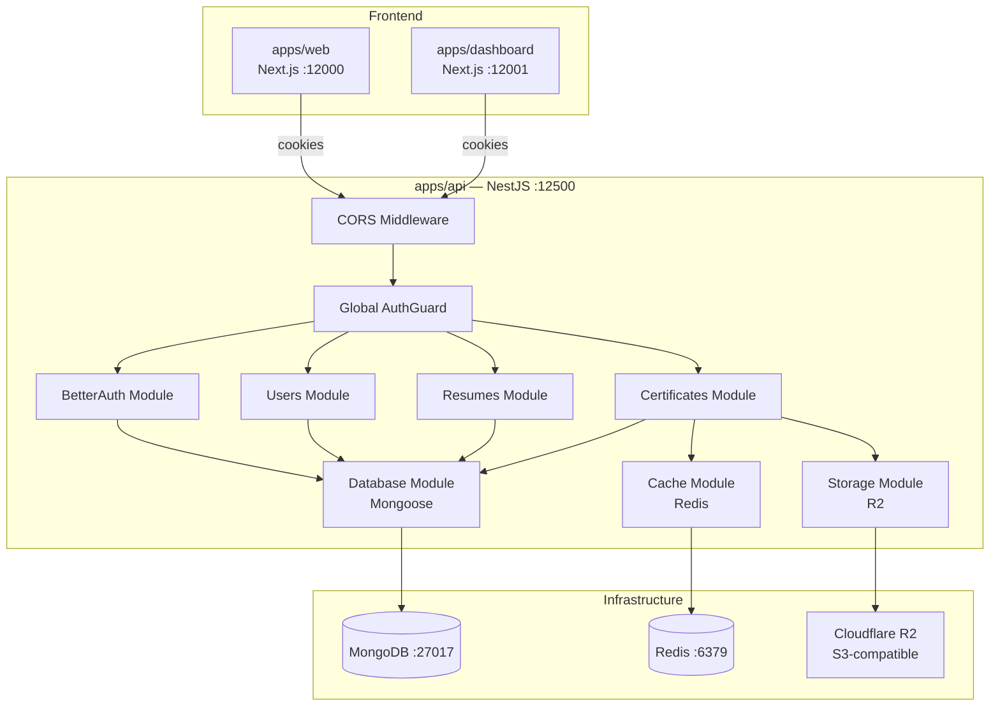
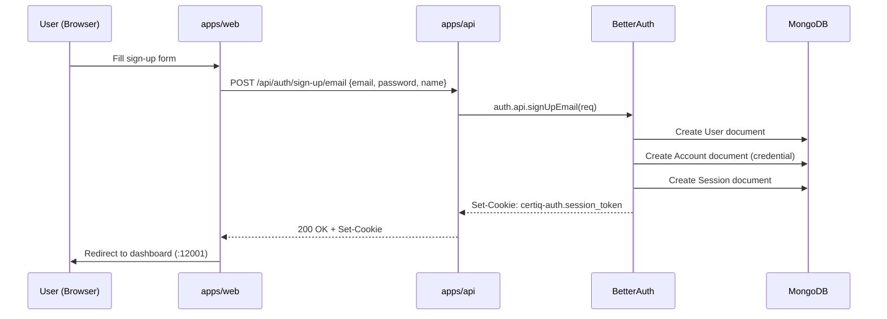
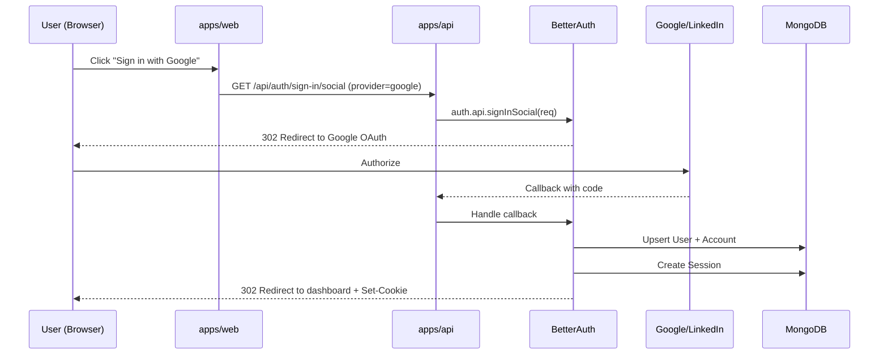
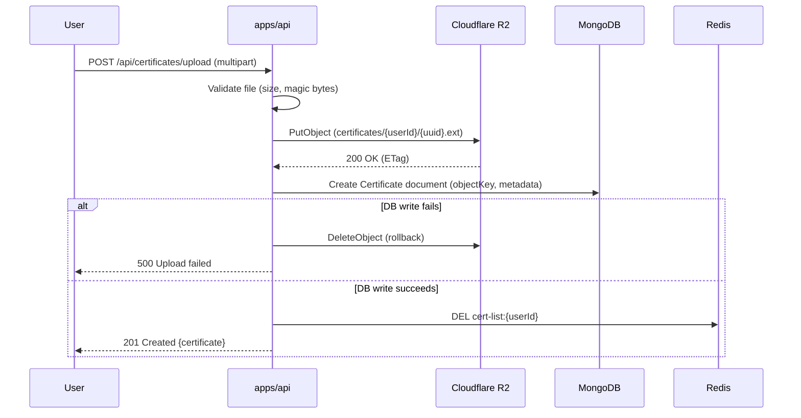
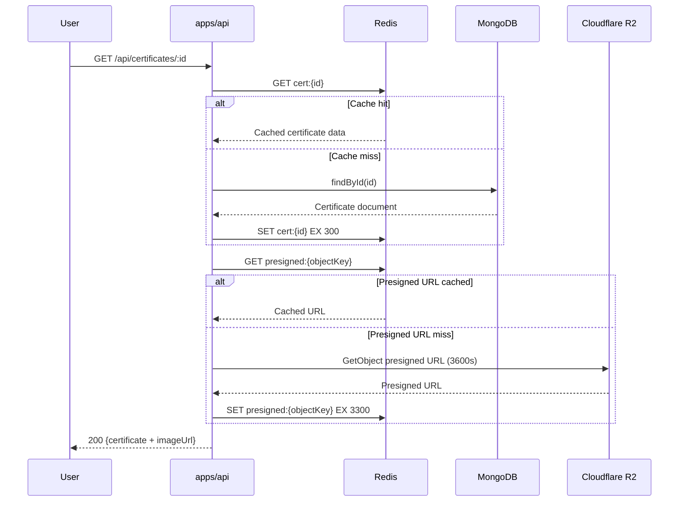

# Design Document: Certiq Custom Backend

## Overview

This design replaces the existing InsForge-based authentication and PostgreSQL/Prisma data layer with a fully self-hosted monolithic backend built on NestJS. The new system uses MongoDB (via Mongoose) for persistence, `better-auth` for cookie-based session authentication with Google/LinkedIn OAuth and email/password flows, Redis for caching, and Cloudflare R2 for object storage.

The architecture remains a single NestJS application (`apps/api`) serving all backend concerns. Both frontend applications (`apps/web` and `apps/dashboard`) will migrate from `@insforge/sdk` to `better-auth/react` client SDK, using cookie-based sessions instead of JWT Bearer tokens. Docker Compose orchestrates local development with MongoDB, Redis, and the API container.

Key migration goals: zero downtime in development workflow, complete removal of InsForge dependencies, and a clean separation between auth, storage, caching, and business logic modules within the monolith.

## Architecture



## Sequence Diagrams

### Authentication Flow: Email Sign-Up



### Authentication Flow: OAuth (Google/LinkedIn)



### Certificate Upload with R2 + Cache Invalidation



### Certificate Retrieval with Cache



## Components and Interfaces

### Component 1: BetterAuth Module

**Purpose**: Handles all authentication concerns — sign-up, sign-in, OAuth, session management, and session validation for the auth guard.

**Interface**:
```typescript
// src/auth/better-auth.instance.ts
import { betterAuth } from "better-auth";
import { mongodbAdapter } from "better-auth/adapters/mongodb";

export interface BetterAuthConfig {
  secret: string;
  baseURL: string;
  database: MongoClient;
  socialProviders: {
    google: { clientId: string; clientSecret: string };
    linkedin: { clientId: string; clientSecret: string };
  };
  session: {
    expiresIn: number;       // 7 days in seconds
    updateAge: number;       // 24 hours in seconds
    cookieCache: {
      enabled: boolean;
      maxAge: number;        // 5 minutes
    };
  };
  advanced: {
    cookiePrefix: string;    // "certiq-auth"
    crossSubDomainCookies: { enabled: boolean };
  };
}

// Auth instance type
export type AuthInstance = ReturnType<typeof betterAuth>;
```

**Responsibilities**:
- Initialize `better-auth` with MongoDB adapter
- Configure Google and LinkedIn OAuth providers
- Manage cookie-based sessions (7-day expiry, 24h refresh)
- Expose auth API routes via NestJS catch-all handler
- Provide session validation for AuthGuard

---

### Component 2: AuthGuard (Global)

**Purpose**: Validates session cookies on every request (except public routes) using better-auth's session API.

**Interface**:
```typescript
// src/auth/auth.guard.ts
import { CanActivate, ExecutionContext } from "@nestjs/common";

export interface SessionUser {
  id: string;
  email: string;
  name: string | null;
  avatarUrl: string | null;
  createdAt: Date;
}

export interface AuthenticatedRequest extends Request {
  user: SessionUser;
  session: {
    id: string;
    userId: string;
    expiresAt: Date;
  };
}

@Injectable()
export class AuthGuard implements CanActivate {
  canActivate(context: ExecutionContext): Promise<boolean>;
}

// Decorator for accessing session user
export const Session = createParamDecorator(
  (data: unknown, ctx: ExecutionContext): SessionUser => {
    return ctx.switchToHttp().getRequest<AuthenticatedRequest>().user;
  }
);

// Decorator to mark routes as public (skip auth)
export const Public = () => SetMetadata("isPublic", true);
```

**Responsibilities**:
- Extract session cookie from incoming requests
- Call `auth.api.getSession()` with request headers
- Attach user and session to request object
- Skip validation for routes marked `@Public()`
- Throw `UnauthorizedException` for invalid/expired sessions

---

### Component 3: Database Module (Mongoose)

**Purpose**: Provides MongoDB connection and Mongoose schema registration for all domain models.

**Interface**:
```typescript
// src/database/database.module.ts
import { MongooseModule } from "@nestjs/mongoose";

// Module configuration
export interface DatabaseConfig {
  uri: string;  // MONGODB_URI from env
  dbName: string;
}

// Exported schemas
export { UserSchema, User, UserDocument } from "./schemas/user.schema";
export { ResumeSchema, Resume, ResumeDocument } from "./schemas/resume.schema";
export { CertificateSchema, Certificate, CertificateDocument } from "./schemas/certificate.schema";
```

**Responsibilities**:
- Establish MongoDB connection via `MongooseModule.forRootAsync()`
- Register all Mongoose schemas
- Provide model injection tokens for services
- Handle connection lifecycle (connect/disconnect)

---

### Component 4: Cache Module (Redis)

**Purpose**: Provides Redis-based caching with graceful degradation and pattern-based invalidation.

**Interface**:
```typescript
// src/cache/cache.service.ts
export interface CacheService {
  get<T>(key: string): Promise<T | null>;
  set<T>(key: string, value: T, ttlSeconds: number): Promise<void>;
  del(key: string): Promise<void>;
  delPattern(pattern: string): Promise<void>;
  isHealthy(): Promise<boolean>;
}

// Cache key patterns
export const CACHE_KEYS = {
  certificate: (id: string) => `cert:${id}`,
  certificateList: (userId: string) => `cert-list:${userId}`,
  presignedUrl: (objectKey: string) => `presigned:${objectKey}`,
} as const;

// TTL values in seconds
export const CACHE_TTL = {
  certificate: 300,       // 5 minutes
  certificateList: 60,    // 1 minute
  presignedUrl: 3300,     // 55 minutes (URL valid for 60)
} as const;
```

**Responsibilities**:
- Connect to Redis via `ioredis`
- Serialize/deserialize cached values (JSON)
- Graceful degradation: return `null` on Redis failure (log warning)
- Pattern-based deletion for cache invalidation
- Health check endpoint support

---

### Component 5: Storage Module (Cloudflare R2)

**Purpose**: Manages file uploads and presigned URL generation for Cloudflare R2 via S3-compatible API.

**Interface**:
```typescript
// src/storage/storage.service.ts
export interface StorageService {
  upload(params: UploadParams): Promise<UploadResult>;
  getPresignedUrl(objectKey: string, expiresIn?: number): Promise<string>;
  delete(objectKey: string): Promise<void>;
}

export interface UploadParams {
  buffer: Buffer;
  objectKey: string;
  contentType: string;
  metadata?: Record<string, string>;
}

export interface UploadResult {
  objectKey: string;
  etag: string;
  size: number;
}

// File validation
export interface FileValidationConfig {
  maxSizeBytes: number;           // 5 * 1024 * 1024 (5MB)
  allowedMimeTypes: string[];     // ["image/png", "image/jpeg", "image/webp", "application/pdf"]
  magicBytes: Map<string, Buffer>; // MIME type → magic byte signature
}

// Object key generation
export function generateObjectKey(userId: string, extension: string): string;
// → "certificates/{userId}/{uuid}.{ext}"
```

**Responsibilities**:
- Initialize S3Client with R2 endpoint and credentials
- Upload files with content-type and metadata
- Generate presigned GET URLs (1h expiry)
- Delete objects (for rollback scenarios)
- Validate file size and magic bytes before upload

---

### Component 6: Certificates Module (Updated)

**Purpose**: CRUD operations for certificates with R2 upload integration and Redis caching.

**Interface**:
```typescript
// src/certificates/certificates.service.ts
export interface CertificatesService {
  create(userId: string, dto: CreateCertificateDto, file?: Express.Multer.File): Promise<Certificate>;
  findAll(userId: string): Promise<CertificateWithUrl[]>;
  findOne(id: string, userId: string): Promise<CertificateWithUrl>;
  update(id: string, userId: string, dto: UpdateCertificateDto): Promise<Certificate>;
  delete(id: string, userId: string): Promise<void>;
}

export interface CreateCertificateDto {
  title: string;
  issuer: string;
  credUrl?: string;
}

export interface CertificateWithUrl extends Certificate {
  imageUrl: string | null;  // Presigned R2 URL
}
```

**Responsibilities**:
- Create certificates with optional image upload to R2
- Atomic upload: rollback R2 object if MongoDB write fails
- Retrieve certificates with cached presigned URLs
- Invalidate cache on create/update/delete
- Enforce user ownership on all operations

## Data Models

### Model 1: User

```typescript
// src/database/schemas/user.schema.ts
import { Prop, Schema, SchemaFactory } from "@nestjs/mongoose";
import { Document, Types } from "mongoose";

@Schema({ timestamps: true, collection: "users" })
export class User {
  _id: Types.ObjectId;

  @Prop({ required: true, unique: true })
  email: string;

  @Prop({ default: null })
  name: string | null;

  @Prop({ default: null })
  avatarUrl: string | null;

  @Prop({ default: false })
  emailVerified: boolean;

  createdAt: Date;
  updatedAt: Date;
}

export type UserDocument = User & Document;
export const UserSchema = SchemaFactory.createForClass(User);
```

**Validation Rules**:
- `email`: Required, unique, valid email format
- `name`: Optional string, max 100 characters
- `avatarUrl`: Optional valid URL

**Indexes**:
- `{ email: 1 }` — unique

---

### Model 2: Account (better-auth managed)

```typescript
// src/database/schemas/account.schema.ts
@Schema({ timestamps: true, collection: "accounts" })
export class Account {
  _id: Types.ObjectId;

  @Prop({ required: true, type: Types.ObjectId, ref: "User" })
  userId: Types.ObjectId;

  @Prop({ required: true })
  providerId: string;  // "credential" | "google" | "linkedin"

  @Prop({ required: true })
  accountId: string;   // Provider-specific user ID

  @Prop({ default: null })
  accessToken: string | null;

  @Prop({ default: null })
  refreshToken: string | null;

  @Prop({ default: null })
  accessTokenExpiresAt: Date | null;

  @Prop({ default: null })
  refreshTokenExpiresAt: Date | null;

  @Prop({ default: null })
  password: string | null;  // Hashed, only for "credential" provider

  createdAt: Date;
  updatedAt: Date;
}

export type AccountDocument = Account & Document;
export const AccountSchema = SchemaFactory.createForClass(Account);
```

**Indexes**:
- `{ userId: 1 }`
- `{ providerId: 1, accountId: 1 }` — unique compound

---

### Model 3: Session (better-auth managed)

```typescript
// src/database/schemas/session.schema.ts
@Schema({ collection: "sessions" })
export class Session {
  _id: Types.ObjectId;

  @Prop({ required: true, type: Types.ObjectId, ref: "User" })
  userId: Types.ObjectId;

  @Prop({ required: true, unique: true })
  token: string;

  @Prop({ required: true })
  expiresAt: Date;

  @Prop({ default: null })
  ipAddress: string | null;

  @Prop({ default: null })
  userAgent: string | null;

  createdAt: Date;
  updatedAt: Date;
}

export type SessionDocument = Session & Document;
export const SessionSchema = SchemaFactory.createForClass(Session);
```

**Indexes**:
- `{ token: 1 }` — unique
- `{ userId: 1 }`
- `{ expiresAt: 1 }` — TTL index for automatic cleanup

---

### Model 4: Verification (better-auth managed)

```typescript
// src/database/schemas/verification.schema.ts
@Schema({ collection: "verifications" })
export class Verification {
  _id: Types.ObjectId;

  @Prop({ required: true })
  identifier: string;  // email or other identifier

  @Prop({ required: true })
  value: string;       // verification token/code

  @Prop({ required: true })
  expiresAt: Date;

  createdAt: Date;
  updatedAt: Date;
}

export type VerificationDocument = Verification & Document;
export const VerificationSchema = SchemaFactory.createForClass(Verification);
```

**Indexes**:
- `{ identifier: 1 }`
- `{ expiresAt: 1 }` — TTL index

---

### Model 5: Resume

```typescript
// src/database/schemas/resume.schema.ts
@Schema({ timestamps: true, collection: "resumes" })
export class Resume {
  _id: Types.ObjectId;

  @Prop({ required: true, type: Types.ObjectId, ref: "User" })
  userId: Types.ObjectId;

  @Prop({ default: "Untitled Resume" })
  title: string;

  @Prop({ default: "executive" })
  templateId: string;

  @Prop({ type: Object, default: {} })
  content: Record<string, unknown>;

  @Prop({ default: false })
  published: boolean;

  @Prop({ default: null, unique: true, sparse: true })
  shareSlug: string | null;

  createdAt: Date;
  updatedAt: Date;
}

export type ResumeDocument = Resume & Document;
export const ResumeSchema = SchemaFactory.createForClass(Resume);
```

**Validation Rules**:
- `userId`: Required, must reference existing User
- `title`: Max 200 characters
- `templateId`: Must be a valid template identifier
- `shareSlug`: Unique when present (sparse index)

**Indexes**:
- `{ userId: 1 }`
- `{ shareSlug: 1 }` — unique, sparse

---

### Model 6: Certificate

```typescript
// src/database/schemas/certificate.schema.ts
@Schema({ timestamps: true, collection: "certificates" })
export class Certificate {
  _id: Types.ObjectId;

  @Prop({ required: true, type: Types.ObjectId, ref: "User" })
  userId: Types.ObjectId;

  @Prop({ required: true })
  title: string;

  @Prop({ required: true })
  issuer: string;

  @Prop({ default: null })
  objectKey: string | null;  // R2 object key (replaces imageUrl)

  @Prop({ default: null })
  credUrl: string | null;

  @Prop({ default: false })
  verified: boolean;

  createdAt: Date;
  updatedAt: Date;
}

export type CertificateDocument = Certificate & Document;
export const CertificateSchema = SchemaFactory.createForClass(Certificate);
```

**Validation Rules**:
- `userId`: Required, must reference existing User
- `title`: Required, max 200 characters
- `issuer`: Required, max 200 characters
- `objectKey`: Pattern `certificates/{userId}/{uuid}.{ext}`
- `credUrl`: Optional valid URL

**Indexes**:
- `{ userId: 1 }`


## Algorithmic Pseudocode

### Authentication Guard Algorithm

```typescript
// Global AuthGuard — validates session on every request
async function canActivate(context: ExecutionContext): Promise<boolean> {
  // PRECONDITION: context contains valid HTTP request
  // POSTCONDITION: request.user is populated OR UnauthorizedException thrown

  const request = context.switchToHttp().getRequest();
  
  // Check if route is marked @Public()
  const isPublic = reflector.getAllAndOverride<boolean>("isPublic", [
    context.getHandler(),
    context.getClass(),
  ]);
  
  if (isPublic) return true;

  // Validate session via better-auth
  const session = await auth.api.getSession({
    headers: fromNodeHeaders(request.headers),
  });

  if (!session || !session.user) {
    throw new UnauthorizedException("Invalid or expired session");
  }

  // Attach to request
  request.user = {
    id: session.user.id,
    email: session.user.email,
    name: session.user.name,
    avatarUrl: session.user.image,
    createdAt: session.user.createdAt,
  };
  request.session = session.session;

  return true;
}
```

**Preconditions:**
- `context` is a valid NestJS `ExecutionContext` with HTTP request
- `auth` instance is initialized and connected to MongoDB

**Postconditions:**
- If route is `@Public()`: returns `true`, no user attached
- If session valid: `request.user` and `request.session` populated, returns `true`
- If session invalid/missing: throws `UnauthorizedException`

---

### File Upload with Atomic Rollback Algorithm

```typescript
// Certificate upload with R2 + MongoDB atomicity
async function uploadCertificate(
  userId: string,
  dto: CreateCertificateDto,
  file: Express.Multer.File
): Promise<Certificate> {
  // PRECONDITION: file passes validation (size ≤ 5MB, valid magic bytes)
  // POSTCONDITION: Certificate in DB with matching R2 object, OR no side effects

  // Step 1: Validate file
  validateFile(file); // throws BadRequestException if invalid

  // Step 2: Generate object key
  const extension = getExtensionFromMime(file.mimetype);
  const objectKey = `certificates/${userId}/${uuid()}.${extension}`;

  // Step 3: Upload to R2
  const uploadResult = await storageService.upload({
    buffer: file.buffer,
    objectKey,
    contentType: file.mimetype,
    metadata: { userId, originalName: file.originalname },
  });

  // Step 4: Create DB record (with rollback on failure)
  try {
    const certificate = await certificateModel.create({
      userId: new Types.ObjectId(userId),
      title: dto.title,
      issuer: dto.issuer,
      objectKey,
      credUrl: dto.credUrl ?? null,
      verified: false,
    });

    // Step 5: Invalidate cache
    await cacheService.del(CACHE_KEYS.certificateList(userId));

    return certificate;
  } catch (error) {
    // ROLLBACK: Delete R2 object if DB write fails
    await storageService.delete(objectKey);
    throw new InternalServerErrorException("Failed to save certificate");
  }
}
```

**Preconditions:**
- `userId` is a valid ObjectId string referencing an existing user
- `file.size` ≤ 5,242,880 bytes (5MB)
- `file.mimetype` ∈ {"image/png", "image/jpeg", "image/webp", "application/pdf"}
- Magic bytes of `file.buffer` match declared `file.mimetype`

**Postconditions:**
- On success: R2 object exists at `objectKey` AND Certificate document exists in MongoDB
- On failure: No R2 object created (rolled back) AND no Certificate document
- Cache `cert-list:{userId}` is invalidated on success

**Loop Invariants:** N/A (no loops)

---

### File Validation Algorithm

```typescript
// Magic-byte validation for uploaded files
function validateFile(file: Express.Multer.File): void {
  // PRECONDITION: file object is defined with buffer, mimetype, size
  // POSTCONDITION: returns void if valid, throws BadRequestException if invalid

  // Check size
  if (file.size > MAX_FILE_SIZE) {
    throw new BadRequestException(
      `File too large. Maximum size is ${MAX_FILE_SIZE / 1024 / 1024}MB`
    );
  }

  // Check MIME type
  if (!ALLOWED_MIME_TYPES.includes(file.mimetype)) {
    throw new BadRequestException(
      `Invalid file type. Allowed: ${ALLOWED_MIME_TYPES.join(", ")}`
    );
  }

  // Validate magic bytes
  const expectedMagic = MAGIC_BYTES.get(file.mimetype);
  if (!expectedMagic) {
    throw new BadRequestException("Unsupported file type");
  }

  const fileHeader = file.buffer.subarray(0, expectedMagic.length);
  if (!fileHeader.equals(expectedMagic)) {
    throw new BadRequestException(
      "File content does not match declared type (magic byte mismatch)"
    );
  }
}

// Magic byte signatures
const MAGIC_BYTES = new Map<string, Buffer>([
  ["image/png", Buffer.from([0x89, 0x50, 0x4e, 0x47])],           // ‰PNG
  ["image/jpeg", Buffer.from([0xff, 0xd8, 0xff])],                 // ÿØÿ
  ["image/webp", Buffer.from([0x52, 0x49, 0x46, 0x46])],          // RIFF
  ["application/pdf", Buffer.from([0x25, 0x50, 0x44, 0x46])],     // %PDF
]);
```

**Preconditions:**
- `file` is non-null with `buffer`, `mimetype`, and `size` properties
- `file.buffer` contains the complete file content

**Postconditions:**
- Returns void (no-op) if file passes all checks
- Throws `BadRequestException` with descriptive message if any check fails
- No side effects on the file object

---

### Cache-Aside Read Algorithm

```typescript
// Cache-aside pattern with graceful degradation
async function getCertificateWithCache(
  id: string,
  userId: string
): Promise<CertificateWithUrl> {
  // PRECONDITION: id is valid ObjectId string, userId matches authenticated user
  // POSTCONDITION: returns CertificateWithUrl or throws NotFoundException

  // Step 1: Try cache
  let certificate: Certificate | null = null;
  try {
    certificate = await cacheService.get<Certificate>(CACHE_KEYS.certificate(id));
  } catch {
    // Redis unavailable — fall through to DB
  }

  // Step 2: Cache miss → query DB
  if (!certificate) {
    certificate = await certificateModel.findOne({
      _id: new Types.ObjectId(id),
      userId: new Types.ObjectId(userId),
    });

    if (!certificate) {
      throw new NotFoundException("Certificate not found");
    }

    // Populate cache (best-effort)
    try {
      await cacheService.set(
        CACHE_KEYS.certificate(id),
        certificate,
        CACHE_TTL.certificate
      );
    } catch {
      // Cache write failed — non-fatal
    }
  }

  // Step 3: Generate presigned URL if objectKey exists
  let imageUrl: string | null = null;
  if (certificate.objectKey) {
    imageUrl = await getPresignedUrlWithCache(certificate.objectKey);
  }

  return { ...certificate, imageUrl };
}

async function getPresignedUrlWithCache(objectKey: string): Promise<string> {
  // Try cache first
  try {
    const cached = await cacheService.get<string>(CACHE_KEYS.presignedUrl(objectKey));
    if (cached) return cached;
  } catch {
    // Fall through
  }

  // Generate new presigned URL
  const url = await storageService.getPresignedUrl(objectKey, 3600);

  // Cache for 55 minutes (URL valid for 60)
  try {
    await cacheService.set(CACHE_KEYS.presignedUrl(objectKey), url, CACHE_TTL.presignedUrl);
  } catch {
    // Non-fatal
  }

  return url;
}
```

**Preconditions:**
- `id` is a valid MongoDB ObjectId string
- `userId` is the authenticated user's ID (ownership check)
- MongoDB connection is available

**Postconditions:**
- Returns `CertificateWithUrl` with populated `imageUrl` (presigned URL or null)
- Throws `NotFoundException` if certificate doesn't exist or user doesn't own it
- Cache is populated on miss (best-effort, non-fatal on failure)

**Loop Invariants:** N/A

---

### BetterAuth Initialization Algorithm

```typescript
// Initialize better-auth instance with MongoDB adapter
function createAuthInstance(config: AppConfig, mongoClient: MongoClient): AuthInstance {
  // PRECONDITION: mongoClient is connected, config contains all required secrets
  // POSTCONDITION: returns configured better-auth instance ready to handle requests

  return betterAuth({
    database: mongodbAdapter(mongoClient.db(config.dbName)),
    secret: config.authSecret,
    baseURL: config.apiBaseUrl,
    basePath: "/api/auth",

    emailAndPassword: {
      enabled: true,
      requireEmailVerification: false,
    },

    socialProviders: {
      google: {
        clientId: config.googleClientId,
        clientSecret: config.googleClientSecret,
      },
      linkedin: {
        clientId: config.linkedinClientId,
        clientSecret: config.linkedinClientSecret,
      },
    },

    session: {
      expiresIn: 7 * 24 * 60 * 60,   // 7 days
      updateAge: 24 * 60 * 60,         // Refresh after 24h
      cookieCache: {
        enabled: true,
        maxAge: 5 * 60,                // 5 min cookie cache
      },
    },

    advanced: {
      cookiePrefix: "certiq-auth",
      crossSubDomainCookies: { enabled: false },
      defaultCookieAttributes: {
        httpOnly: true,
        sameSite: "lax",
        secure: config.isProduction,
        path: "/",
      },
    },

    trustedOrigins: config.corsOrigins,
  });
}
```

**Preconditions:**
- `mongoClient` is connected to MongoDB
- `config.authSecret` is a cryptographically random string (≥32 chars)
- OAuth client IDs and secrets are valid
- `config.apiBaseUrl` matches the actual API URL

**Postconditions:**
- Returns a fully configured `betterAuth` instance
- Instance can handle sign-up, sign-in, OAuth, and session operations
- Session cookies use "certiq-auth" prefix with secure attributes

## Key Functions with Formal Specifications

### Function: `AuthController.handleAuthRoutes()`

```typescript
@Controller("auth")
export class AuthController {
  @All("*splat")
  @Public()
  async handleAuthRoutes(
    @Req() req: Request,
    @Res() res: Response
  ): Promise<void>;
}
```

**Preconditions:**
- Request path starts with `/api/auth/`
- Request is a valid HTTP request (any method)

**Postconditions:**
- Delegates to better-auth's internal router
- Response is sent directly (not through NestJS interceptors)
- Auth routes are public (no session required)

---

### Function: `StorageService.upload()`

```typescript
async upload(params: UploadParams): Promise<UploadResult>;
```

**Preconditions:**
- `params.buffer` is non-empty and ≤ 5MB
- `params.objectKey` follows pattern `certificates/{userId}/{uuid}.{ext}`
- `params.contentType` is a valid MIME type
- R2 credentials are configured and valid

**Postconditions:**
- Object exists in R2 bucket at `params.objectKey`
- Returns `UploadResult` with `etag` and `size`
- On failure: throws, no partial object in R2

---

### Function: `CacheService.delPattern()`

```typescript
async delPattern(pattern: string): Promise<void>;
```

**Preconditions:**
- `pattern` is a valid Redis glob pattern (e.g., `cert-list:*`)
- Redis connection is available (or graceful degradation)

**Postconditions:**
- All keys matching `pattern` are deleted from Redis
- If Redis unavailable: logs warning, does not throw
- Returns void regardless of outcome

## Example Usage

### API Module Registration

```typescript
// src/app.module.ts
@Module({
  imports: [
    ConfigModule.forRoot({ isGlobal: true }),
    MongooseModule.forRootAsync({
      imports: [ConfigModule],
      useFactory: (config: ConfigService) => ({
        uri: config.getOrThrow<string>("MONGODB_URI"),
      }),
      inject: [ConfigService],
    }),
    AuthModule,
    CacheModule,
    StorageModule,
    HealthModule,
    UsersModule,
    ResumesModule,
    CertificatesModule,
  ],
  providers: [
    { provide: APP_GUARD, useClass: AuthGuard },
  ],
})
export class AppModule {}
```

### Frontend Auth Client (apps/web)

```typescript
// apps/web/lib/auth-client.ts
import { createAuthClient } from "better-auth/react";

export const authClient = createAuthClient({
  baseURL: process.env.NEXT_PUBLIC_API_URL!, // http://localhost:12500
  basePath: "/api/auth",
});

export const {
  signIn,
  signUp,
  signOut,
  useSession,
} = authClient;
```

### Frontend Auth Client (apps/dashboard)

```typescript
// apps/dashboard/lib/auth-client.ts
import { createAuthClient } from "better-auth/react";

export const authClient = createAuthClient({
  baseURL: process.env.NEXT_PUBLIC_API_URL!,
  basePath: "/api/auth",
});

export const { useSession, signOut } = authClient;
```

### Certificate Upload Example

```typescript
// Dashboard: Upload certificate with image
const formData = new FormData();
formData.append("title", "AWS Solutions Architect");
formData.append("issuer", "Amazon Web Services");
formData.append("file", selectedFile);

const response = await fetch(`${API_URL}/api/certificates/upload`, {
  method: "POST",
  body: formData,
  credentials: "include", // Send session cookie
});

const certificate = await response.json();
// { id: "...", title: "AWS Solutions Architect", imageUrl: "https://r2-presigned-url..." }
```

### Docker Compose Usage

```yaml
# docker-compose.yml
services:
  mongodb:
    image: mongo:7
    ports:
      - "27017:27017"
    volumes:
      - mongodb_data:/data/db
    healthcheck:
      test: ["CMD", "mongosh", "--eval", "db.adminCommand('ping')"]
      interval: 10s
      timeout: 5s
      retries: 5

  redis:
    image: redis:7-alpine
    ports:
      - "6379:6379"
    command: redis-server --appendonly yes
    volumes:
      - redis_data:/data
    healthcheck:
      test: ["CMD", "redis-cli", "ping"]
      interval: 10s
      timeout: 5s
      retries: 5

  api:
    build:
      context: .
      dockerfile: apps/api/Dockerfile
    ports:
      - "12500:12500"
    environment:
      - MONGODB_URI=mongodb://mongodb:27017/certiq
      - REDIS_URL=redis://redis:6379
      - PORT=12500
    depends_on:
      mongodb:
        condition: service_healthy
      redis:
        condition: service_healthy
    healthcheck:
      test: ["CMD", "curl", "-f", "http://localhost:12500/api/health"]
      interval: 15s
      timeout: 5s
      retries: 3

volumes:
  mongodb_data:
  redis_data:
```

## Correctness Properties

*A property is a characteristic or behavior that should hold true across all valid executions of a system — essentially, a formal statement about what the system should do. Properties serve as the bridge between human-readable specifications and machine-verifiable correctness guarantees.*

### Property 1: AuthGuard Session Validation

*For any* incoming request to a protected route, if the session cookie is valid and not expired, the AuthGuard SHALL attach the correct user object (id, email, name, avatarUrl, createdAt) to the request and return true; if the session is invalid, expired, or missing, the AuthGuard SHALL throw UnauthorizedException without attaching any user data.

**Validates: Requirements 3.1, 3.2, 3.3**

### Property 2: OAuth Idempotency

*For any* OAuth callback with the same provider and accountId received multiple times, the system SHALL always return the same user document without creating duplicates — the user count for that provider+accountId combination remains exactly one.

**Validates: Requirement 2.4**

### Property 3: Unique Constraint Enforcement

*For any* two documents that share a value on a uniquely-indexed field (User.email, Session.token, Account.(providerId+accountId), or Resume.shareSlug when non-null), the second insert SHALL be rejected by the database. For Resume.shareSlug, multiple null values SHALL be permitted (sparse index).

**Validates: Requirements 4.3, 4.4, 4.5, 4.8**

### Property 4: Cache Serialization Round-Trip

*For any* JSON-serializable value stored via Cache_Service.set() and subsequently retrieved via Cache_Service.get() with the same key, the returned value SHALL be deeply equal to the original value.

**Validates: Requirements 5.2, 5.3**

### Property 5: Cache Pattern Deletion

*For any* set of cache keys matching a given glob pattern, after Cache_Service.delPattern() is called with that pattern, all matching keys SHALL be removed from Redis and subsequent get operations on those keys SHALL return null.

**Validates: Requirement 5.4**

### Property 6: Cache Graceful Degradation

*For any* cache operation (get, set, del, delPattern) performed while Redis is unavailable, the Cache_Service SHALL not throw an exception — reads SHALL return null and writes SHALL silently fail.

**Validates: Requirement 5.5**

### Property 7: Object Key Format Validity

*For any* valid userId string and file extension, the generated object key SHALL match the pattern `certificates/{userId}/{uuid}.{ext}` where uuid is a valid UUID v4 and ext is the provided extension.

**Validates: Requirement 6.2**

### Property 8: File Validation Soundness

*For any* file accepted by the validation function, the file size SHALL be ≤ 5,242,880 bytes, the MIME type SHALL be one of (image/png, image/jpeg, image/webp, application/pdf), and the file's leading bytes SHALL match the magic byte signature for the declared MIME type. Conversely, *for any* file that violates any of these conditions, the validation function SHALL reject it with a 400 Bad Request.

**Validates: Requirements 7.1, 7.2, 7.3, 7.4, 7.5**

### Property 9: Upload Atomicity

*For any* certificate upload operation, the final system state SHALL be either (R2 object exists AND MongoDB document exists) or (neither exists). If the MongoDB write fails after a successful R2 upload, the R2 object SHALL be deleted (rolled back).

**Validates: Requirement 8.2**

### Property 10: Cache Invalidation on Writes

*For any* write operation (create, update, or delete) on a certificate belonging to a user, the cache key `cert-list:{userId}` SHALL be invalidated before the response is returned to the client.

**Validates: Requirement 8.5**

### Property 11: Ownership Enforcement

*For any* resource (certificate or resume) and any authenticated user who is not the owner (resource.userId ≠ authenticatedUser.id), the system SHALL deny access and return a 404 Not Found response.

**Validates: Requirements 8.7, 9.1, 9.2, 9.3**

## Error Handling

### Error Scenario 1: Redis Unavailable

**Condition**: Redis connection fails or times out
**Response**: Log warning, bypass cache, serve directly from MongoDB/R2
**Recovery**: Automatic reconnection via ioredis retry strategy (exponential backoff, max 10 retries)

### Error Scenario 2: R2 Upload Failure

**Condition**: S3 PutObject fails (network error, auth failure, bucket issue)
**Response**: Return 500 to client with message "File upload failed"
**Recovery**: No cleanup needed (upload didn't complete). Client can retry.

### Error Scenario 3: MongoDB Write Failure After R2 Upload

**Condition**: Certificate document creation fails after successful R2 upload
**Response**: Delete the R2 object (rollback), return 500 to client
**Recovery**: Automatic — rollback ensures no orphaned objects

### Error Scenario 4: Session Expired

**Condition**: Session cookie present but session expired in MongoDB
**Response**: Return 401 Unauthorized
**Recovery**: Client redirects to login page, user re-authenticates

### Error Scenario 5: OAuth Provider Unavailable

**Condition**: Google/LinkedIn OAuth endpoint unreachable
**Response**: better-auth returns error, frontend shows "Provider unavailable" message
**Recovery**: User can try again or use email/password authentication

### Error Scenario 6: File Validation Failure

**Condition**: Uploaded file exceeds size limit or magic bytes don't match
**Response**: Return 400 Bad Request with specific error message
**Recovery**: Client shows validation error, user selects different file

### Error Scenario 7: MongoDB Connection Lost

**Condition**: MongoDB connection drops during operation
**Response**: Mongoose auto-reconnects; in-flight requests get 500 error
**Recovery**: Automatic reconnection via Mongoose connection pool. Subsequent requests succeed.

## Testing Strategy

### Unit Testing Approach

- Test each service in isolation with mocked dependencies
- Test `AuthGuard` with mocked better-auth session responses
- Test `CacheService` with mocked ioredis
- Test `StorageService` with mocked S3Client
- Test file validation with various buffer inputs (valid/invalid magic bytes)
- Test cache key generation functions
- Framework: Vitest + @nestjs/testing

### Property-Based Testing Approach

**Property Test Library**: fast-check

Key properties to test:
- File validation accepts all valid files and rejects all invalid files (fuzz with random buffers)
- Cache key generation is deterministic and collision-free
- Object key generation produces valid S3 keys for any valid userId
- Session validation correctly identifies expired vs valid sessions

### Integration Testing Approach

- Test auth flows end-to-end with real MongoDB (testcontainers or in-memory)
- Test certificate CRUD with real Redis and mocked R2
- Test cache invalidation patterns
- Test Docker Compose health checks
- Framework: Vitest + supertest + testcontainers

## Performance Considerations

- **Redis caching** reduces MongoDB queries for frequently accessed certificates
- **Presigned URL caching** (55min) avoids repeated R2 signing operations
- **Cookie-based sessions** eliminate per-request token validation API calls (vs InsForge's remote validation)
- **Connection pooling**: Mongoose maintains connection pool to MongoDB (default 5 connections)
- **File size limit** (5MB) prevents memory pressure from large uploads
- **Multer memory storage** is acceptable for 5MB limit; switch to disk/streaming for larger files
- **MongoDB indexes** on userId fields ensure O(log n) lookups for user-scoped queries

## Security Considerations

- **Cookie security**: HttpOnly prevents XSS token theft; SameSite=Lax prevents CSRF for state-changing requests
- **CORS**: Strict origin allowlist (localhost:12000, :12001 + production domains)
- **Password hashing**: Handled by better-auth (bcrypt/argon2 internally)
- **Magic-byte validation**: Prevents file type spoofing (extension-only checks are insufficient)
- **Presigned URLs**: Time-limited access to R2 objects; no direct bucket access
- **Ownership checks**: All resource operations verify `userId` matches authenticated session
- **Secret management**: Auth secret, OAuth credentials, R2 keys stored in environment variables only
- **Session rotation**: better-auth rotates session tokens on refresh (prevents session fixation)
- **Input validation**: DTOs validated via class-validator decorators before processing

## Dependencies

### Production Dependencies (apps/api)

| Package | Purpose |
|---------|---------|
| `@nestjs/common`, `@nestjs/core`, `@nestjs/platform-express` | NestJS framework |
| `@nestjs/config` | Environment configuration |
| `@nestjs/mongoose` | MongoDB/Mongoose integration |
| `mongoose` | MongoDB ODM |
| `better-auth` | Authentication library |
| `ioredis` | Redis client |
| `@aws-sdk/client-s3` | S3-compatible API (R2) |
| `@aws-sdk/s3-request-presigner` | Presigned URL generation |
| `multer` | File upload handling |
| `reflect-metadata` | NestJS metadata |
| `rxjs` | NestJS reactive extensions |

### Production Dependencies (apps/web, apps/dashboard)

| Package | Purpose |
|---------|---------|
| `better-auth` | Auth client SDK (`better-auth/react`) |

### Packages to Remove

| Package | Location | Replacement |
|---------|----------|-------------|
| `@insforge/sdk` | apps/web, apps/dashboard | `better-auth/react` |
| `@prisma/client` | apps/api | `mongoose` via `@nestjs/mongoose` |
| `prisma` | apps/api (dev) | Removed |
| `pg` | apps/api | Removed (no PostgreSQL) |

### Infrastructure

| Service | Version | Purpose |
|---------|---------|---------|
| MongoDB | 7.x | Primary database |
| Redis | 7.x (Alpine) | Caching layer |
| Cloudflare R2 | — | Object storage (S3-compatible) |

### Environment Variables

```
# MongoDB
MONGODB_URI=mongodb://localhost:27017/certiq

# Redis
REDIS_URL=redis://localhost:6379

# better-auth
BETTER_AUTH_SECRET=<random-32-char-string>
BETTER_AUTH_URL=http://localhost:12500

# OAuth - Google
GOOGLE_CLIENT_ID=<google-client-id>
GOOGLE_CLIENT_SECRET=<google-client-secret>

# OAuth - LinkedIn
LINKEDIN_CLIENT_ID=<linkedin-client-id>
LINKEDIN_CLIENT_SECRET=<linkedin-client-secret>

# Cloudflare R2
R2_ACCOUNT_ID=<cloudflare-account-id>
R2_ACCESS_KEY_ID=<r2-access-key>
R2_SECRET_ACCESS_KEY=<r2-secret-key>
R2_BUCKET_NAME=certiq-certificates
R2_PUBLIC_URL=<optional-public-bucket-url>

# CORS
CORS_ORIGINS=http://localhost:12000,http://localhost:12001

# General
PORT=12500
NODE_ENV=development
```


## Key Functions with Formal Specifications

### Function 1: better-auth Instance (`src/auth/auth.ts`)

```typescript
import { betterAuth } from "better-auth";
import { mongodbAdapter } from "better-auth/adapters/mongodb";
import { MongoClient } from "mongodb";

const client = new MongoClient(process.env.MONGODB_URI!);
const db = client.db();

export const auth = betterAuth({
  database: mongodbAdapter(db),
  baseURL: process.env.BETTER_AUTH_URL,  // http://localhost:12500
  basePath: "/api/auth",
  secret: process.env.AUTH_SECRET,
  emailAndPassword: {
    enabled: true,
    minPasswordLength: 8,
    maxPasswordLength: 128,
  },
  socialProviders: {
    google: {
      clientId: process.env.GOOGLE_CLIENT_ID!,
      clientSecret: process.env.GOOGLE_CLIENT_SECRET!,
    },
    linkedin: {
      clientId: process.env.LINKEDIN_CLIENT_ID!,
      clientSecret: process.env.LINKEDIN_CLIENT_SECRET!,
    },
  },
  session: {
    expiresIn: 60 * 60 * 24 * 7,   // 7 days
    updateAge: 60 * 60 * 24,        // Refresh within 1 day of expiry
    cookieCache: {
      enabled: true,
      maxAge: 5 * 60,               // 5 min cache
    },
  },
  advanced: {
    cookiePrefix: "certiq-auth",
    crossSubDomainCookies: { enabled: false },
    defaultCookieAttributes: {
      httpOnly: true,
      sameSite: "lax",
      secure: process.env.NODE_ENV === "production",
      path: "/",
    },
  },
  trustedOrigins: [
    "http://localhost:12000",
    "http://localhost:12001",
  ],
});

export type Auth = typeof auth;
```

**Preconditions:**
- `MONGODB_URI` is a valid MongoDB connection string
- `AUTH_SECRET` is a random string ≥32 characters
- OAuth client IDs/secrets are valid for their respective providers

**Postconditions:**
- Auth instance handles all `/api/auth/*` routes
- Sessions stored in MongoDB `sessions` collection
- Cookies set with prefix `certiq-auth`, httpOnly, sameSite=lax

---

### Function 2: AuthGuard.canActivate()

```typescript
async canActivate(context: ExecutionContext): Promise<boolean> {
  // Step 1: Check if route is marked @Public()
  const isPublic = this.reflector.getAllAndOverride<boolean>("isPublic", [
    context.getHandler(),
    context.getClass(),
  ]);
  if (isPublic) return true;

  // Step 2: Extract request and validate session
  const request = context.switchToHttp().getRequest();
  const response = context.switchToHttp().getResponse();

  const session = await auth.api.getSession({
    headers: request.headers,
  });

  if (!session?.user) {
    throw new UnauthorizedException("Authentication required");
  }

  // Step 3: Attach user and session to request
  request.user = {
    id: session.user.id,
    email: session.user.email,
    name: session.user.name ?? null,
    avatarUrl: session.user.image ?? null,
    createdAt: session.user.createdAt,
  };
  request.session = session.session;

  return true;
}
```

**Preconditions:**
- Request contains HTTP headers (may or may not have session cookie)
- `auth` instance is initialized and connected to MongoDB

**Postconditions:**
- If route is `@Public()`: returns true without validation
- If valid session cookie: attaches `user` and `session` to request, returns true
- If missing/invalid/expired cookie: throws `UnauthorizedException` (HTTP 401)

---

### Function 3: CertificatesService.upload()

```typescript
async upload(userId: string, file: Express.Multer.File, dto: CreateCertificateDto): Promise<CertificateWithUrl> {
  // Step 1: Validate file
  validateFile(file); // throws BadRequestException on failure

  // Step 2: Generate object key
  const ext = getExtensionFromMime(file.mimetype);
  const objectKey = `certificates/${userId}/${randomUUID()}.${ext}`;

  // Step 3: Upload to R2
  await this.storageService.upload({
    buffer: file.buffer,
    objectKey,
    contentType: file.mimetype,
  });

  // Step 4: Create MongoDB document (rollback R2 on failure)
  let certificate: CertificateDocument;
  try {
    certificate = await this.certificateModel.create({
      userId,
      title: dto.title.trim(),
      issuer: dto.issuer.trim(),
      objectKey,
      credUrl: dto.credUrl ?? null,
    });
  } catch (error) {
    await this.storageService.delete(objectKey);
    throw error;
  }

  // Step 5: Invalidate cache
  await this.cacheService.del(CACHE_KEYS.certificateList(userId));

  // Step 6: Generate presigned URL for response
  const imageUrl = await this.storageService.getPresignedUrl(objectKey);

  return { ...certificate.toObject(), imageUrl };
}
```

**Preconditions:**
- `userId` is a valid authenticated user ID
- `file` is non-null with size ≤ 5MB and mimetype in allowed set
- `dto.title` is 1–200 characters, `dto.issuer` is 1–200 characters

**Postconditions:**
- File stored in R2 at generated objectKey
- Certificate document exists in MongoDB with objectKey
- User's certificate list cache invalidated
- Returns certificate with resolved presigned URL
- If DB write fails, R2 object is deleted (atomic)

---

### Function 4: CertificatesService.findAll()

```typescript
async findAll(userId: string): Promise<CertificateWithUrl[]> {
  // Step 1: Check cache
  const cacheKey = CACHE_KEYS.certificateList(userId);
  const cached = await this.cacheService.get<CertificateWithUrl[]>(cacheKey);
  if (cached) return cached;

  // Step 2: Query MongoDB
  const certificates = await this.certificateModel
    .find({ userId })
    .sort({ createdAt: -1 })
    .lean();

  // Step 3: Resolve presigned URLs
  const withUrls = await Promise.all(
    certificates.map(async (cert) => {
      let imageUrl: string | null = null;
      if (cert.objectKey) {
        const urlCacheKey = CACHE_KEYS.presignedUrl(cert.objectKey);
        imageUrl = await this.cacheService.get<string>(urlCacheKey);
        if (!imageUrl) {
          imageUrl = await this.storageService.getPresignedUrl(cert.objectKey);
          await this.cacheService.set(urlCacheKey, imageUrl, CACHE_TTL.presignedUrl);
        }
      }
      return { ...cert, imageUrl };
    })
  );

  // Step 4: Cache result
  await this.cacheService.set(cacheKey, withUrls, CACHE_TTL.certificateList);

  return withUrls;
}
```

**Preconditions:**
- `userId` is a valid authenticated user ID

**Postconditions:**
- Returns all certificates for user, ordered by createdAt desc
- Each certificate has imageUrl resolved to presigned URL (or null)
- Result cached for 60s; presigned URLs cached for 3300s
- If Redis unavailable, falls through to MongoDB + R2

---

### Function 5: CacheService (graceful degradation)

```typescript
async get<T>(key: string): Promise<T | null> {
  try {
    const raw = await this.redis.get(key);
    return raw ? JSON.parse(raw) : null;
  } catch (error) {
    this.logger.warn(`Redis GET failed for ${key}: ${error.message}`);
    return null;
  }
}

async set<T>(key: string, value: T, ttlSeconds: number): Promise<void> {
  try {
    await this.redis.set(key, JSON.stringify(value), "EX", ttlSeconds);
  } catch (error) {
    this.logger.warn(`Redis SET failed for ${key}: ${error.message}`);
  }
}

async del(key: string): Promise<void> {
  try {
    await this.redis.del(key);
  } catch (error) {
    this.logger.warn(`Redis DEL failed for ${key}: ${error.message}`);
  }
}
```

**Invariant:** Cache failures NEVER propagate to the caller. All methods catch errors and return gracefully.

---

### Function 6: StorageService.getPresignedUrl()

```typescript
async getPresignedUrl(objectKey: string, expiresIn = 3600): Promise<string> {
  const command = new GetObjectCommand({
    Bucket: this.bucketName,
    Key: objectKey,
    ResponseContentDisposition: "attachment",
  });
  return getSignedUrl(this.s3Client, command, { expiresIn });
}
```

**Preconditions:**
- `objectKey` references an existing R2 object
- S3Client configured with valid R2 credentials

**Postconditions:**
- Returns HTTPS URL valid for `expiresIn` seconds (default 1h)
- URL scoped to specific object key only
- Content-Disposition: attachment prevents XSS

## Frontend Auth Client

### Web App (`apps/web/lib/auth-client.ts`)

```typescript
import { createAuthClient } from "better-auth/react";

export const authClient = createAuthClient({
  baseURL: process.env.NEXT_PUBLIC_API_URL ?? "http://localhost:12500",
  basePath: "/api/auth",
});
```

### Web App AuthProvider (`apps/web/lib/auth/AuthProvider.tsx`)

```typescript
"use client";
import { createContext, useContext, useCallback, useMemo, type ReactNode } from "react";
import { authClient } from "@/lib/auth-client";

interface User {
  id: string;
  email: string;
  name?: string;
  image?: string;
}

interface AuthContextValue {
  user: User | null;
  loading: boolean;
  signInWithGoogle: () => Promise<void>;
  signInWithLinkedIn: () => Promise<void>;
  signInWithEmail: (email: string, password: string) => Promise<{ error?: string }>;
  signUp: (email: string, password: string, name?: string) => Promise<{ error?: string }>;
  signOut: () => Promise<void>;
}

const AuthContext = createContext<AuthContextValue | null>(null);

export function AuthProvider({ children }: { children: ReactNode }) {
  const { data: session, isPending } = authClient.useSession();

  const user: User | null = session?.user ?? null;

  const signInWithGoogle = useCallback(async () => {
    await authClient.signIn.social({
      provider: "google",
      callbackURL: getDashboardUrl(),
    });
  }, []);

  const signInWithLinkedIn = useCallback(async () => {
    await authClient.signIn.social({
      provider: "linkedin",
      callbackURL: getDashboardUrl(),
    });
  }, []);

  const signInWithEmail = useCallback(async (email: string, password: string) => {
    const { error } = await authClient.signIn.email({ email, password });
    if (error) return { error: error.message };
    window.location.href = getDashboardUrl();
    return {};
  }, []);

  const signUp = useCallback(async (email: string, password: string, name?: string) => {
    const { error } = await authClient.signUp.email({ email, password, name: name ?? "" });
    if (error) return { error: error.message };
    return {};
  }, []);

  const signOut = useCallback(async () => {
    await authClient.signOut();
  }, []);

  const value = useMemo(
    () => ({ user, loading: isPending, signInWithGoogle, signInWithLinkedIn, signInWithEmail, signUp, signOut }),
    [user, isPending, signInWithGoogle, signInWithLinkedIn, signInWithEmail, signUp, signOut],
  );

  return <AuthContext.Provider value={value}>{children}</AuthContext.Provider>;
}

export function useAuth() {
  const ctx = useContext(AuthContext);
  if (!ctx) throw new Error("useAuth must be used within AuthProvider");
  return ctx;
}

function getDashboardUrl(): string {
  if (typeof window === "undefined") return "http://localhost:12001";
  return window.location.origin.replace(":12000", ":12001");
}
```

### Dashboard Auth Provider (`apps/dashboard/lib/auth.tsx`)

```typescript
"use client";
import { createContext, useContext, useCallback, useEffect, useMemo, useState, type ReactNode } from "react";
import { authClient } from "@/lib/auth-client";

const MIN_LOADING_TIME = 2500;

export function DashboardAuthProvider({ children }: { children: ReactNode }) {
  const [ready, setReady] = useState(false);
  const { data: session, isPending } = authClient.useSession();

  useEffect(() => {
    const start = Date.now();
    let attempts = 0;

    async function trySession() {
      while (attempts < 3 && Date.now() - start < 5000) {
        attempts++;
        const { data } = await authClient.getSession();
        if (data?.user) {
          const elapsed = Date.now() - start;
          if (elapsed < MIN_LOADING_TIME) {
            await new Promise(r => setTimeout(r, MIN_LOADING_TIME - elapsed));
          }
          setReady(true);
          return;
        }
        await new Promise(r => setTimeout(r, 800));
      }
      window.location.href = getLandingUrl();
    }

    trySession();
  }, []);

  const signOut = useCallback(async () => {
    await authClient.signOut();
    window.location.href = getLandingUrl();
  }, []);

  // ... context provider with user, loading, signOut
}

function getLandingUrl(): string {
  if (typeof window === "undefined") return "http://localhost:12000";
  return window.location.origin.replace(":12001", ":12000");
}
```

## Docker Compose Configuration

```yaml
version: "3.9"
services:
  mongodb:
    image: mongo:7
    ports:
      - "27017:27017"
    volumes:
      - mongodata:/data/db
    environment:
      MONGO_INITDB_ROOT_USERNAME: certiq
      MONGO_INITDB_ROOT_PASSWORD: ${MONGO_PASSWORD:-certiq_dev}
    healthcheck:
      test: ["CMD", "mongosh", "--eval", "db.adminCommand('ping')"]
      interval: 5s
      timeout: 5s
      retries: 5

  redis:
    image: redis:7-alpine
    ports:
      - "6379:6379"
    volumes:
      - redisdata:/data
    command: redis-server --appendonly yes
    healthcheck:
      test: ["CMD", "redis-cli", "ping"]
      interval: 5s
      timeout: 3s
      retries: 5

  api:
    build:
      context: .
      dockerfile: apps/api/Dockerfile
    ports:
      - "12500:12500"
    environment:
      MONGODB_URI: mongodb://certiq:${MONGO_PASSWORD:-certiq_dev}@mongodb:27017/certiq?authSource=admin
      AUTH_SECRET: ${AUTH_SECRET}
      BETTER_AUTH_URL: http://localhost:12500
      GOOGLE_CLIENT_ID: ${GOOGLE_CLIENT_ID}
      GOOGLE_CLIENT_SECRET: ${GOOGLE_CLIENT_SECRET}
      LINKEDIN_CLIENT_ID: ${LINKEDIN_CLIENT_ID}
      LINKEDIN_CLIENT_SECRET: ${LINKEDIN_CLIENT_SECRET}
      REDIS_URL: redis://redis:6379
      R2_ACCOUNT_ID: ${R2_ACCOUNT_ID}
      R2_ACCESS_KEY_ID: ${R2_ACCESS_KEY_ID}
      R2_SECRET_ACCESS_KEY: ${R2_SECRET_ACCESS_KEY}
      R2_BUCKET_NAME: ${R2_BUCKET_NAME:-certiq-certificates}
      R2_ENDPOINT: ${R2_ENDPOINT}
      CORS_ORIGINS: ${CORS_ORIGINS:-}
      NODE_ENV: ${NODE_ENV:-development}
    depends_on:
      mongodb:
        condition: service_healthy
      redis:
        condition: service_healthy

volumes:
  mongodata:
  redisdata:
```

### Dockerfile (`apps/api/Dockerfile`)

```dockerfile
FROM node:20-alpine AS base
RUN corepack enable && corepack prepare pnpm@latest --activate

FROM base AS deps
WORKDIR /app
COPY pnpm-lock.yaml pnpm-workspace.yaml package.json ./
COPY apps/api/package.json apps/api/
COPY packages/ packages/
RUN pnpm install --frozen-lockfile --filter @certiq/api...

FROM base AS builder
WORKDIR /app
COPY --from=deps /app .
COPY apps/api/ apps/api/
RUN pnpm --filter @certiq/api run build

FROM base AS runner
WORKDIR /app
COPY --from=builder /app/apps/api/dist ./dist
COPY --from=builder /app/apps/api/package.json ./
COPY --from=builder /app/node_modules ./node_modules
COPY --from=builder /app/apps/api/node_modules ./apps_node_modules

EXPOSE 12500
CMD ["node", "dist/main.js"]
```

## Environment Variables

### API (`apps/api/.env`)

| Variable | Description | Default |
|----------|-------------|---------|
| `MONGODB_URI` | MongoDB connection string | `mongodb://localhost:27017/certiq` |
| `AUTH_SECRET` | better-auth secret key (≥32 chars) | — |
| `BETTER_AUTH_URL` | Public URL of the API | `http://localhost:12500` |
| `GOOGLE_CLIENT_ID` | Google OAuth client ID | — |
| `GOOGLE_CLIENT_SECRET` | Google OAuth client secret | — |
| `LINKEDIN_CLIENT_ID` | LinkedIn OAuth client ID | — |
| `LINKEDIN_CLIENT_SECRET` | LinkedIn OAuth client secret | — |
| `REDIS_URL` | Redis connection URL | `redis://localhost:6379` |
| `R2_ACCOUNT_ID` | Cloudflare account ID | — |
| `R2_ACCESS_KEY_ID` | R2 access key | — |
| `R2_SECRET_ACCESS_KEY` | R2 secret key | — |
| `R2_BUCKET_NAME` | R2 bucket name | `certiq-certificates` |
| `R2_ENDPOINT` | R2 S3-compatible endpoint | — |
| `MAX_FILE_SIZE` | Max upload size in bytes | `5242880` |
| `CORS_ORIGINS` | Additional CORS origins (comma-separated) | — |
| `NODE_ENV` | Environment | `development` |
| `PORT` | API port | `12500` |

### Frontend (`apps/web/.env.local` and `apps/dashboard/.env.local`)

| Variable | Description | Default |
|----------|-------------|---------|
| `NEXT_PUBLIC_API_URL` | Backend API URL | `http://localhost:12500` |

## Error Handling

### Authentication Errors

| Scenario | HTTP Status | Error Code | Response |
|----------|-------------|------------|----------|
| Invalid email format on sign-up | 422 | `VALIDATION_ERROR` | "Invalid email format" |
| Password too short/long | 422 | `VALIDATION_ERROR` | "Password must be 8-128 characters" |
| Duplicate email on sign-up | 409 | `USER_ALREADY_EXISTS` | "Email already registered" |
| Invalid credentials on sign-in | 401 | `INVALID_CREDENTIALS` | "Invalid email or password" |
| Missing/invalid session cookie | 401 | `UNAUTHORIZED` | "Authentication required" |
| Expired session | 401 | `SESSION_EXPIRED` | "Session expired" |
| OAuth provider error | 302 | — | Redirect to web app with `?error=oauth_error` |
| OAuth missing email | 302 | — | Redirect with `?error=email_required` |

### Storage Errors

| Scenario | HTTP Status | Error Code | Recovery |
|----------|-------------|------------|----------|
| R2 unreachable during upload | 503 | `STORAGE_UNAVAILABLE` | Client retries |
| R2 upload timeout (>30s) | 504 | `UPLOAD_TIMEOUT` | Client retries |
| R2 unreachable during URL generation | — | — | Return cert with null imageUrl |
| R2 delete fails after DB delete | — | — | Log warning (eventual consistency) |

### File Validation Errors

| Scenario | HTTP Status | Error Code |
|----------|-------------|------------|
| File too large (>5MB) | 400 | `FILE_TOO_LARGE` |
| Invalid MIME type | 400 | `INVALID_FILE_TYPE` |
| No file provided | 400 | `FILE_REQUIRED` |
| Corrupted file | 400 | `INVALID_FILE` |

### Cache Errors

| Scenario | Behavior |
|----------|----------|
| Redis connection refused | Fall through to DB/R2, log warning |
| Redis timeout (>500ms) | Abandon cache op, continue |
| Redis OOM | Fall through, cache stops writes |

### Authorization Errors

| Scenario | HTTP Status | Error Code |
|----------|-------------|------------|
| No session cookie | 401 | `UNAUTHORIZED` |
| Certificate belongs to another user | 403 | `FORBIDDEN` |
| Certificate not found | 404 | `NOT_FOUND` |

## Correctness Properties

### Property 1: Sign-up Round Trip

*For any* valid email (RFC 5322, ≤254 chars) and valid password (8–128 chars), signing up SHALL create a User document, an Account document, and a Session document in MongoDB, and the returned session cookie SHALL be usable to retrieve the same user's information.

### Property 2: Sign-in Round Trip

*For any* user previously signed up with email and password, signing in with those credentials SHALL return a valid session cookie that identifies that user.

### Property 3: Duplicate Email Rejection

*For any* valid email, if a user already exists with that email, attempting to sign up again SHALL return an error and SHALL NOT create a duplicate User document.

### Property 4: Generic Error on Invalid Credentials

*For any* sign-in attempt with non-existent email or wrong password, the system SHALL return the same error structure, preventing email enumeration.

### Property 5: Password Hashing

*For any* password used during sign-up, the value stored in the Account document's password field SHALL NOT equal the plaintext input.

### Property 6: Upload-Retrieve Round Trip

*For any* valid file (≤5MB, allowed MIME) and valid metadata, uploading a certificate SHALL result in a retrievable document where the API response resolves the objectKey to a valid presigned URL.

### Property 7: Ownership Isolation

*For any* two distinct users A and B, user B SHALL NOT be able to retrieve, update, or delete certificates belonging to user A. All such attempts SHALL return 403.

### Property 8: Cache Invalidation on Mutation

*For any* certificate mutation (create, update, delete), all related cache entries SHALL be invalidated, ensuring subsequent reads reflect the current state.

### Property 9: Upload Atomicity

*For any* upload where the MongoDB write fails after a successful R2 upload, the R2 object SHALL be cleaned up. No orphaned objects SHALL persist without a corresponding document.

### Property 10: File Validation Enforcement

*For any* file with size > 5MB OR MIME type not in the allowed set, the upload SHALL be rejected with 400 and no R2 object or document SHALL be created.

### Property 11: Cache Graceful Degradation

*For any* request where Redis is unavailable, the system SHALL still return correct results from MongoDB and R2 directly, with no error visible to the client.

## Testing Strategy

### Property-Based Tests (fast-check + vitest)

- Sign-up/sign-in round trips with randomized valid inputs
- Duplicate email rejection with arbitrary emails
- File validation with arbitrary file sizes and MIME types
- Ownership isolation with random user pairs
- Cache invalidation verification after mutations

### Unit Tests

- AuthGuard: mock auth.api.getSession(), verify 401 on failure, skip for @Public()
- CacheService: mock ioredis, verify graceful degradation
- StorageService: mock S3Client, verify upload/delete/presigned URL calls
- CertificatesService: mock all dependencies, test orchestration logic
- File validation: boundary conditions (exactly 5MB, 5MB+1, each MIME type)

### Integration Tests

- Full auth flow with real MongoDB (sign-up → sign-in → session → sign-out)
- Certificate upload → retrieve → delete lifecycle with real R2 + Redis
- OAuth flow with mocked provider
- Docker compose startup sequence

### Smoke Tests

- All apps build successfully (`pnpm run build`)
- No InsForge references in codebase
- Auth endpoints respond at `/api/auth/*`
- Health endpoint responds at `/api/health`

## Dependencies

### New Packages — `apps/api`

| Package | Purpose |
|---------|---------|
| `better-auth` | Authentication library |
| `@nestjs/mongoose` | NestJS Mongoose integration |
| `mongoose` | MongoDB ODM |
| `ioredis` | Redis client |
| `@aws-sdk/client-s3` | S3-compatible client for R2 |
| `@aws-sdk/s3-request-presigner` | Presigned URL generation |
| `multer` | Multipart file upload |
| `@types/multer` | TypeScript types (devDep) |
| `mongodb` | MongoDB driver (for better-auth adapter) |

### Packages to Remove — `apps/api`

| Package | Reason |
|---------|--------|
| `@prisma/client` | Replaced by Mongoose |
| `prisma` (devDep) | No longer needed |
| `pg` | PostgreSQL driver no longer needed |

### New Packages — `apps/web` and `apps/dashboard`

| Package | Purpose |
|---------|---------|
| `better-auth` | Auth client SDK (`better-auth/react`) |

### Packages to Remove — `apps/web` and `apps/dashboard`

| Package | Reason |
|---------|--------|
| `@insforge/sdk` | Replaced by better-auth client |

### Dev Dependencies — `apps/api`

| Package | Purpose |
|---------|---------|
| `fast-check` | Property-based testing |

## Migration: InsForge Removal Checklist

### Files to Delete

- `apps/web/lib/insforge.ts`
- `apps/dashboard/lib/insforge.ts` (if exists)

### Files to Rewrite

- `apps/web/lib/auth/AuthProvider.tsx` → better-auth based
- `apps/dashboard/lib/auth.tsx` → better-auth based
- `apps/api/src/auth/auth.guard.ts` → better-auth session validation
- `apps/api/src/auth/auth.module.ts` → better-auth module
- `apps/web/components/LoginModal.tsx` → use new `useAuth()` hook

### Environment Variables to Remove

- `NEXT_PUBLIC_INSFORGE_URL` (web, dashboard)
- `NEXT_PUBLIC_INSFORGE_ANON_KEY` (web, dashboard)
- `INSFORGE_URL` (api)

### Package.json Changes

- Remove `@insforge/sdk` from `apps/web/package.json`
- Remove `@insforge/sdk` from `apps/dashboard/package.json`

### Verification

- `pnpm run build` succeeds across all apps
- `grep -r "insforge" apps/` returns zero results
- `grep -r "@insforge" .` returns zero results
