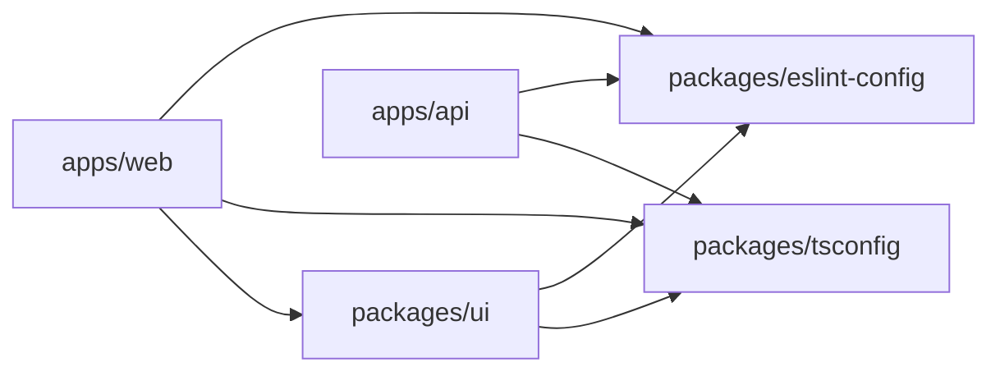
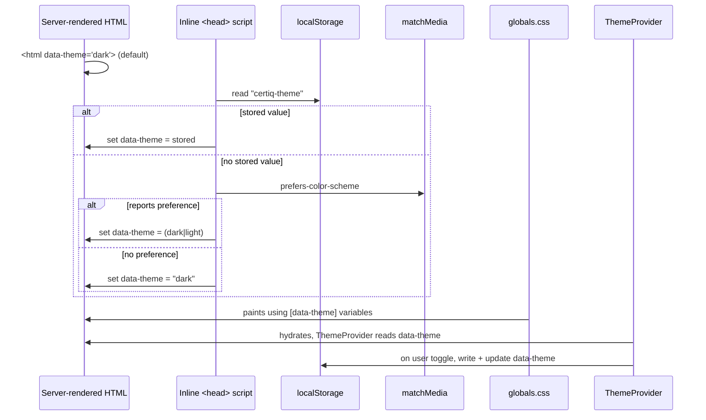
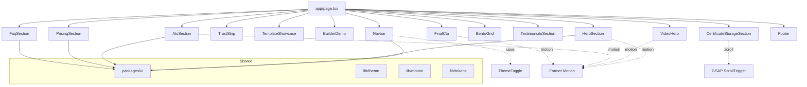

# Design Document

## Overview

The Certiq landing page is a single-page Next.js (App Router) application rendered inside a Turborepo monorepo that also houses a NestJS API. The page is composed of 14 sequentially arranged sections, united by one design system, two first-class themes (`dark`, `light`), and one shared motion vocabulary. Interactive product surfaces (builder, certificate uploader, ATS panel, template gallery) are **visual demonstrations only**, backed by mock data kept in dedicated data modules.

Key design decisions:

1. **Theme as a CSS-variable contract, not a React prop.** A `data-theme` attribute on `<html>` toggles an entire palette defined once in a single stylesheet. Every visual token — background, text, glass surface, border, shadow, glow — resolves via `var(--token)`. React owns the *preference* (system, persisted, user toggle); CSS owns the *rendering*. This keeps the SSR boundary clean, avoids hydration flicker, and makes a theme flip a single attribute mutation. (Requirements 1, 22.)
2. **Pre-hydration inline script to eliminate FOUC.** The initial `data-theme` attribute is set by a tiny inline script in `<head>` before the stylesheet paints, sourced from `localStorage` then `prefers-color-scheme` then `dark`. (Requirement 22.2–22.4.)
3. **Motion split by concern.** Framer Motion handles component-local reveals, hover, float, and staggered lists. GSAP + ScrollTrigger handles long scroll-driven timelines (video scale-in, ATS progress fills, certificate upload choreography). A single `useReducedMotion` hook gates all of them. (Requirement 3, 20.11.)
4. **Mock data is a first-class module.** Every section reads from `apps/web/data/*.ts` so content changes never require component edits, and so property and snapshot tests can inject deterministic fixtures. (Requirement 21.13.)
5. **No backend coupling for landing-page scope.** `apps/api` exists with a `/health` endpoint to prove the monorepo wires together, but the landing page fetches nothing from it. (Requirement 21.14, 21.5.)
6. **Performance is budgeted, not hoped for.** Below-the-fold sections are dynamically imported; the Video_Hero is lazy-mounted behind a visibility + scroll gate; Tailwind's JIT + `next/font` subsetting keep the critical payload inside the 250 KB gzipped budget. (Requirement 19.)
7. **Accessibility is enforced at the token layer.** Contrast ratios are validated as a property across both themes for every text/background pair, not just spot-checked. Focus rings compose an Accent_Color outline with an optional dark halo in light theme to preserve 3:1 contrast. (Requirement 20.)

### Research Summary

- **Next.js App Router + theming without flicker.** The canonical pattern is an inline script in the `<head>` of the root layout that reads `localStorage` and `matchMedia('(prefers-color-scheme: dark)')`, then sets `document.documentElement.dataset.theme` before React hydrates. This is the approach used by `next-themes` and by shadcn/ui's theming recipe. We implement it directly rather than taking `next-themes` as a dependency, to keep the critical JS payload small and avoid the library's MutationObserver cost. (Sources: [Next.js docs on `next/font` and layouts](https://nextjs.org/docs/app), [`next-themes` behavior notes](https://github.com/pacocoursey/next-themes#readme).)
- **Motion library choice.** Framer Motion's `motion` components, `AnimatePresence`, `useReducedMotion`, and `useInView` cover component reveals, float, hover, and stagger. GSAP's ScrollTrigger is better than Framer Motion's `useScroll` for long pinned timelines (ATS section fills, certificate upload). We adopt both and document the boundary: any animation whose progress depends on scroll position over more than one viewport height uses GSAP; everything else uses Framer Motion.
- **Turborepo shape.** pnpm workspaces with `apps/web`, `apps/api`, and `packages/{ui,tsconfig,eslint-config}` is the idiomatic layout. `turbo.json` declares `build`, `dev`, `lint`, `test` pipelines with `^build` dependency wiring so `packages/ui` builds before `apps/web`. (Source: [Turborepo docs on workspace structure](https://turbo.build/repo/docs).)
- **Video loading discipline.** Autoplay + muted + `playsinline` is the cross-browser mobile autoplay contract. Pausing when off-screen or when the tab is hidden is driven by `IntersectionObserver` and `document.visibilitychange`. A ≤ 6 MB H.264 MP4 with an AV1/WebM alternate is the pragmatic envelope. ([MDN: autoplay, IntersectionObserver, Page Visibility API](https://developer.mozilla.org/).)
- **WCAG contrast.** The 4.5:1 threshold applies to normal text, 3:1 to large text (≥ 18.66 px bold or ≥ 24 px regular) and non-text UI. The light-theme Accent_Color on an off-white background is the risky pair; we mitigate with the composed focus ring specified in Requirement 20.4.

## Architecture

### Monorepo Layout

```
certiq/
├── apps/
│   ├── web/                      # Next.js 14+ App Router, landing page
│   └── api/                      # NestJS, /health only (scaffold)
├── packages/
│   ├── ui/                       # Shared primitives (Button, GlassCard, etc.)
│   ├── tsconfig/                 # tsconfig.base.json, tsconfig.nextjs.json, tsconfig.nestjs.json
│   └── eslint-config/            # Shared ESLint flat configs
├── turbo.json                    # build / dev / lint / test pipelines
├── pnpm-workspace.yaml
├── package.json                  # root scripts, devDependencies
└── README.md
```

Workspace dependency graph:



`apps/web` never imports from `apps/api`. This is enforced by ESLint's `no-restricted-imports` at the app boundary.

### `apps/web` Internal Structure

```
apps/web/
├── app/
│   ├── layout.tsx                # Root layout, font loading, inline theme script, <ThemeProvider>
│   ├── page.tsx                  # Composes the 14 sections
│   ├── globals.css               # CSS variables per [data-theme], noise overlay, base resets
│   └── head-theme-script.ts      # String literal for the pre-hydration inline script
├── components/
│   ├── sections/                 # One file per section (14 files)
│   │   ├── Navbar.tsx
│   │   ├── HeroSection.tsx
│   │   ├── VideoHero.tsx
│   │   ├── TrustStrip.tsx
│   │   ├── TemplateShowcase.tsx
│   │   ├── BuilderDemo.tsx
│   │   ├── CertificateStorageSection.tsx
│   │   ├── AtsSection.tsx
│   │   ├── BentoGrid.tsx
│   │   ├── TestimonialsSection.tsx
│   │   ├── PricingSection.tsx
│   │   ├── FaqSection.tsx
│   │   ├── FinalCta.tsx
│   │   └── Footer.tsx
│   └── effects/                  # NoiseOverlay, ParticleField, AccentGlow, ScrollParallax
├── lib/
│   ├── theme/                    # resolveInitialTheme, persistTheme, ThemeProvider, useTheme
│   ├── motion/                   # variants, easings, useReducedMotionSafe, useInViewReveal
│   ├── tokens.ts                 # Token types + compile-time token map (mirrors CSS vars)
│   ├── contrast.ts               # relativeLuminance, contrastRatio helpers
│   └── cn.ts                     # classnames helper
├── data/                         # Mock content (templates, testimonials, pricing, faq, features)
├── public/
│   ├── video/                    # product-demo.mp4, product-demo.webm, product-demo-poster.jpg
│   └── images/                   # Template previews, avatars
├── tailwind.config.ts            # Tokens bound to CSS variables
├── next.config.ts
└── __tests__/                    # Unit, property, snapshot, a11y tests
```

### Rendering Strategy

- `app/layout.tsx` is a **Server Component**. It emits `<html lang="en" data-theme="dark">` with an inline theme-resolution script placed inside `<head>` *before* the stylesheet link. `data-theme` is initialised on the server to `dark` (the documented default) and replaced by the inline script before first paint.
- `app/page.tsx` is a **Server Component** that composes section components. Sections that do not need interactivity (Footer, parts of Trust_Strip, static parts of Pricing, Testimonials, FAQ structure) render on the server. Sections with motion or interaction (Navbar toggle, Hero floating cards, VideoHero, BuilderDemo, ATS fills, FAQ accordion, FinalCta particles) are **Client Components** marked `"use client"`.
- Below-the-fold client sections are loaded via `next/dynamic({ ssr: true, loading: ... })` with a lightweight skeleton that reserves height (CLS protection). This keeps the initial critical JS payload inside the 250 KB gzipped budget (Requirement 19.7).

### Theme Delivery Pipeline



Every theme-dependent value (background palette, text, surfaces, borders, shadows, glows, focus ring halo) is a CSS custom property declared in two blocks:

```css
:root[data-theme="dark"] { --bg-1: #0F172A; --bg-2: #111827; --bg-3: #1E293B; /* ... */ }
:root[data-theme="light"] { --bg-1: #FFFFFF; --bg-2: #F8FAFC; --bg-3: #EEF2F7; /* ... */ }
```

Tailwind's `tailwind.config.ts` exposes these as `theme.colors.bg.1` etc., resolved via `rgb(var(--bg-1) / <alpha-value>)` so alpha utilities keep working. Tailwind's `darkMode: ['attribute', '[data-theme="dark"]']` (or `['class', '[data-theme="dark"]']` depending on Tailwind version) aligns the `dark:` variant with the attribute scheme (Requirement 21.16).

### Motion Architecture

| Concern | Library | Trigger |
|---|---|---|
| Section entrance fade + Y translation | Framer Motion | `useInView({ once: true, margin: "-10%" })` |
| Hero floating cards (continuous 4–10 px sine) | Framer Motion | `animate` loop with `repeat: Infinity` |
| Mouse-follow parallax on Hero/VideoHero | Framer Motion | `useMotionValue` + `useSpring` on pointer |
| Template card hover scale + glow | Framer Motion | `whileHover`, `whileTap` |
| VideoHero scale-in | Framer Motion | `useInView` threshold 0.25 |
| ATS progress fill (0 → mock value) | Framer Motion | `useInView` threshold 0.30, `once: true` |
| Certificate upload choreography | GSAP + ScrollTrigger | Scroll progress through section |
| Scroll parallax on floating orbs | GSAP + ScrollTrigger | Section-scoped ScrollTrigger |
| Staggered headline char reveal (FinalCta) | Framer Motion | `useInView` + `staggerChildren` |
| FAQ accordion height | Framer Motion `<motion.div>` with `layout` | Controlled open state |

A single `useReducedMotionSafe()` hook wraps Framer Motion's `useReducedMotion()` and returns a record of flags (`disableParallax`, `disableFloat`, `disableHoverScale`, `instantEntrance`, `hideParticles`). Every motion-aware component consults this hook. GSAP timelines check `prefers-reduced-motion` via `window.matchMedia` in a `useLayoutEffect` and kill themselves if set.

### Font Loading

```ts
// app/layout.tsx
import { Instrument_Serif, Inter } from "next/font/google";

const serif = Instrument_Serif({
  subsets: ["latin"],
  weight: ["400"],
  display: "swap",
  variable: "--font-serif",
  preload: true,
});

const sans = Inter({
  subsets: ["latin"],
  weight: ["400", "500", "600"],
  display: "swap",
  variable: "--font-sans",
  preload: true,
});
```

Both families are exposed as CSS variables and referenced from Tailwind's `theme.fontFamily` (`serif: ['var(--font-serif)', ...]`, `sans: ['var(--font-sans)', ...]`). This satisfies Requirement 2.10 (swap + non-blocking + subsetting). The glossary's approved alternates are listed in the font stack for `font-family` fallback.

### Video Loading Discipline

`VideoHero` is mounted only after:
1. `HeroSection` has entered the viewport (tracked by an IntersectionObserver at the page level), **AND**
2. Window `scrollY` ≥ 200 px.

Both conditions are gated by a single `useShouldMountVideoHero()` hook, satisfying Requirement 19.8. Once mounted, `IntersectionObserver` with `threshold: [0, 0.1, 0.25]` drives play/pause (play ≥ 25 %, pause < 10 %), and a `document.visibilitychange` listener pauses when the tab is hidden (Requirement 6.6, 6.7). An 8-second timeout armed on `loadstart` and cleared on `canplay` swaps to the static poster fallback (Requirement 6.8).

## Components and Interfaces

### Shared Primitives (`packages/ui`)

```ts
// Button
type ButtonVariant = "primary" | "secondary";
interface ButtonProps extends React.ButtonHTMLAttributes<HTMLButtonElement> {
  variant?: ButtonVariant; // default "primary"
  asChild?: boolean;       // render as <a> for anchors while keeping semantics
}
// Rendering contract:
//   variant="primary"   → pill, Accent_Color bg, #0F172A text, Accent_Glow on hover, h ≥ 44px
//   variant="secondary" → pill, transparent/glass bg, Text_Headline text, 1px Card_Border, h ≥ 44px

// GlassCard
interface GlassCardProps extends React.HTMLAttributes<HTMLDivElement> {
  tint?: "default" | "strong"; // maps to --card-surface-1 or --card-surface-2
  interactive?: boolean;        // enables hover lift + accent glow
}
// Applies: backdrop-blur (12–24 px), Card_Surface fill, Card_Border, theme-tuned drop shadow.

// SectionWrapper
interface SectionWrapperProps {
  id: string;              // anchor target for smooth-scroll navigation
  eyebrow?: string;        // rendered in Text_Muted, uppercase, tracked
  heading?: string;        // Headline_Serif
  description?: string;    // Body_Sans, Text_Body
  align?: "start" | "center";
  children: React.ReactNode;
}
// Enforces: vertical padding ≥ 96 px desktop, ≥ 64 px mobile (Requirement 2.11).

// ThemeToggle
interface ThemeToggleProps {
  className?: string;
}
// Renders a 44×44 px button. aria-pressed reflects (theme === "dark").
// aria-label: "Switch to light mode" when dark, "Switch to dark mode" when light.

// Accordion (controlled, multi-open)
interface AccordionItem { id: string; question: string; answer: React.ReactNode; }
interface AccordionProps { items: AccordionItem[]; }
// Each trigger: <button aria-expanded aria-controls> with Enter/Space activation.

// Badge, Chip, ProgressIndicator (linear + circular), Tooltip, Avatar (with initials fallback).
```

### Section Components (`apps/web/components/sections`)

Each section is a self-contained component with a single responsibility and a narrow prop surface. Sections read their content from `apps/web/data/*`, not from props, so page composition stays declarative.

| Component | Variant | Content Source | Responsibility |
|---|---|---|---|
| `Navbar` | client | nav links constant | Fixed glass nav, scroll-compaction, mobile overlay, theme toggle, smooth-scroll to section anchors. |
| `HeroSection` | client | hero constants | Split layout, headline (H1), 5 floating cards with float + mouse-follow, ambient accent glow, fallback for asset load failure. |
| `VideoHero` | client | video manifest | Mounted lazily, autoplay gate, visibility + tab-visibility pause, 8s load-error → poster fallback, scale-in reveal. |
| `TrustStrip` | server | `data/features.ts` | Six bento tiles, responsive (row / 3×2 / scroll-snap). |
| `TemplateShowcase` | client | `data/templates.ts` | 6 cards, single-selection state, hover scale + glow, responsive (grid / scroll-snap). |
| `BuilderDemo` | client | `data/builder.ts` | Form (7 sections) + live preview, controlled local state, Autosaved pulse, AI suggestion popup, 3+ preview themes. No persistence beyond page session. |
| `CertificateStorageSection` | client | `data/certificates.ts` | Floating certificate cards with tilt, scroll-triggered upload choreography (GSAP), Verified badge. |
| `AtsSection` | client | `data/ats.ts` | Score indicator, keyword chips, strength meter, suggestions. All fills animate 0 → mock once on enter. |
| `BentoGrid` | server + client tiles | `data/bento.ts` | Asymmetrical grid, tiles reflow to 2-col / 1-col. Hover glow is client-local. |
| `TestimonialsSection` | client | `data/testimonials.ts` | ≥ 6 cards, staggered fade-in, marquee + pause-on-hover, static-stack fallback if marquee fails. |
| `PricingSection` | server | `data/pricing.ts` | 3 tiers, Pro highlighted + scaled, mobile stack with Pro first. |
| `FaqSection` | client | `data/faq.ts` | Accordion (multi-open), chevron rotate, keyboard operable. |
| `FinalCta` | client | constants | Headline stagger reveal, particles (6–24, reduced-motion-safe), gradient + accent-glow focal, CTA buttons with anchor-nav behavior. |
| `Footer` | server | `data/footer.ts` | Logo, link columns (Product/Company/Legal), social icons, copyright with `new Date().getFullYear()`, one-step-darker/lighter background. |

### Hooks and Utilities (`apps/web/lib`)

```ts
// lib/theme
export type Theme = "dark" | "light";
export function resolveInitialTheme(input: {
  stored: string | null;
  prefersDark: boolean | null;  // null when matchMedia unsupported / no preference
}): Theme;
export function persistTheme(theme: Theme): void;  // writes localStorage under "certiq-theme"
export function readPersistedTheme(): Theme | null;
export function useTheme(): { theme: Theme; setTheme: (t: Theme) => void; toggle: () => void };

// lib/motion
export const EASE_PREMIUM = [0.22, 1, 0.36, 1] as const;
export const variants: {
  fadeUp: Variants;        // y: 24 → 0, opacity: 0 → 1, duration 600–800ms
  scaleIn: Variants;       // scale: 0.96 → 1, opacity: 0 → 1, duration 600–1000ms
  staggerContainer: Variants;
  staggerChild: Variants;
  floatY: Variants;        // y: -6 → 6, repeat: Infinity, duration 4–8s
};
export function useReducedMotionSafe(): {
  reduced: boolean;
  disableParallax: boolean;
  disableFloat: boolean;
  disableHoverScale: boolean;
  instantEntrance: boolean;
  hideParticles: boolean;
};
export function useInViewReveal(ref: React.RefObject<Element>, threshold?: number): boolean;

// lib/tokens
export type DesignToken =
  | "bg.1" | "bg.2" | "bg.3"
  | "text.headline" | "text.body" | "text.muted"
  | "surface.card.1" | "surface.card.2"
  | "border.card"
  | "shadow.glass"
  | "accent" | "accent.alt";
export function resolveToken(token: DesignToken, theme: Theme): string;
// Pure function mirroring the CSS variable map. Used by property tests and non-CSS contexts
// (e.g., programmatically tinting SVG fills).

// lib/contrast
export function relativeLuminance(hex: string): number;
export function contrastRatio(a: string, b: string): number;
// Used both for tests (property: all text tokens ≥ 4.5:1 vs background in both themes)
// and at runtime for the focus-ring halo decision in light theme.

// lib/cn
export function cn(...args: ClassValue[]): string;
```

### Diagram: Page Composition



## Data Models

### Theme and Tokens

```ts
export type Theme = "dark" | "light";

export interface ThemeTokens {
  background: { 1: string; 2: string; 3: string };
  text:       { headline: string; body: string; muted: string };
  accent:     { primary: string; alt: string };
  surface:    { card1: string; card2: string };
  border:     { card: string };
  shadow:     { glass: string };
  glow:       { accentOpacityHover: [number, number]; accentOpacityAmbient: [number, number] };
  overlay:    { noiseOpacity: [number, number] };
}

export const DARK_TOKENS: ThemeTokens = { /* Requirement 1 dark values */ };
export const LIGHT_TOKENS: ThemeTokens = { /* Requirement 1 light values */ };
export const TOKENS: Record<Theme, ThemeTokens> = { dark: DARK_TOKENS, light: LIGHT_TOKENS };
```

The CSS-variable stylesheet is generated from `TOKENS` at build time (or hand-maintained with a unit test asserting it matches `TOKENS`), eliminating drift between the JS and CSS representations.

### Mock Content Schemas

```ts
// data/templates.ts
export interface Template {
  id: "executive" | "minimal" | "developer" | "student" | "creative" | "ats-professional";
  name: string;               // max 30 chars (Requirement 8.2)
  category: string;           // max 25 chars
  previewImage: StaticImageData;
}
export const TEMPLATES: readonly [Template, Template, Template, Template, Template, Template];

// data/testimonials.ts
export interface Testimonial {
  id: string;
  quote: string;
  name: string;
  profession: string;
  company: string;
  avatarUrl?: string;         // absent → initials fallback
}
export const TESTIMONIALS: Testimonial[]; // length ≥ 6

// data/pricing.ts
export interface PricingTier {
  id: "free" | "pro" | "team";
  name: string;
  price: string;              // "$0", "$12/mo", etc. — mock
  description: string;
  features: string[];         // length ≥ 4
  ctaLabel: string;
  ctaVariant: "primary" | "secondary";
  highlighted: boolean;       // true only for "pro"
}
export const PRICING_TIERS: [PricingTier, PricingTier, PricingTier];

// data/faq.ts
export interface FaqItem { id: string; question: string; answer: string; }
export const FAQ_ITEMS: FaqItem[]; // length ≥ 6

// data/features.ts (Trust_Strip)
export interface FeatureTile {
  id: "ats" | "pdf" | "ai" | "certs" | "share" | "templates";
  title: "ATS Friendly" | "One Click PDF Export" | "AI Writing Assistant"
       | "Certificate Storage" | "Shareable Resume Links" | "Modern Templates";
  description: string;
  icon: React.ComponentType<{ className?: string }>;
}
export const FEATURES: readonly [FeatureTile, ...FeatureTile[]]; // length = 6

// data/bento.ts
export interface BentoTile {
  id: string;
  span: "1x1" | "2x1" | "1x2" | "2x2"; // at least two tiles must not be 1x1 (Req 12.2)
  title: string;
  render: React.ComponentType;          // mini-UI renderer (chart, icon, metric)
}
export const BENTO_TILES: BentoTile[];  // length ≥ 6, ≥ 2 non-1x1

// data/ats.ts
export interface AtsKeyword { term: string; matched: boolean; }
export interface AtsSuggestion { id: string; text: string; } // 20–120 chars
export interface AtsMock {
  score: number;                // integer 60–95 (Req 11.2)
  strength: number;             // 0–100
  keywords: AtsKeyword[];       // length ≥ 3
  suggestions: AtsSuggestion[]; // length ≥ 3
}

// data/builder.ts
export interface BuilderSection {
  id: "profile" | "skills" | "education" | "projects" | "certifications" | "experience" | "theme";
  label: string;
  sampleFields: Array<{ name: string; value: string }>;
}
export interface BuilderMock {
  sections: BuilderSection[];         // length = 7
  previewThemes: string[];            // length ≥ 3 (Req 9.6)
  aiSuggestions: Record<string, string[]>;
}

// data/certificates.ts
export interface CertificateMock {
  id: string;
  title: string;
  issuer: string;
  verified: boolean;                  // at least one true (Req 10.4)
  tiltDeg: number;                    // -3 to +3
  thumbnail: StaticImageData;
}
export const CERTIFICATES: CertificateMock[]; // length ≥ 3
```

### Motion Variants (`lib/motion/variants.ts`)

```ts
export const fadeUp: Variants = {
  hidden: { opacity: 0, y: 24 },
  show:   { opacity: 1, y: 0, transition: { duration: 0.7, ease: EASE_PREMIUM } },
};
export const scaleIn: Variants = {
  hidden: { opacity: 0, scale: 0.96 },
  show:   { opacity: 1, scale: 1, transition: { duration: 0.8, ease: EASE_PREMIUM } },
};
// floatY, staggerContainer, staggerChild, accordionHeight, etc.
```

All durations live in the [400 ms, 1200 ms] band (Requirement 3.2) except the reduced-motion replacements, which are ≤ 150 ms.

### Tailwind Token Exposure

`tailwind.config.ts` registers every theme-dependent token as a Tailwind color bound to a CSS variable, so `bg-bg-1`, `text-text-headline`, `border-border-card`, etc., resolve correctly under both `data-theme` values. The Accent_Color is exposed as `accent` / `accent-alt` with no theme variance (Requirement 22.10). Tailwind's `darkMode` is configured as `['attribute', '[data-theme="dark"]']` so utility variants work both directions.


## Correctness Properties

*A property is a characteristic or behavior that should hold true across all valid executions of a system — essentially, a formal statement about what the system should do. Properties serve as the bridge between human-readable specifications and machine-verifiable correctness guarantees.*

Property-based testing (PBT) is appropriate for the parts of this feature that are pure functions or have clear state transitions: the theme-resolution function, the token map, the contrast helpers, the data-module invariants, the selection/accordion/theme state machines, the video lifecycle gate, and the style-band invariants over rendered motion variants. Rendering aesthetics (exact pixel look of floating cards, specific copy, cinematic "feel") are covered by example-based unit tests, snapshot tests, and visual regression; performance budgets are verified by integration tests (Lighthouse, bundle analyzer). This split follows the decision guide: pure logic with universal input variation gets PBT; infrastructure and external-service behavior gets integration tests.

### Property 1: Initial theme resolution follows precedence and round-trips through persistence

*For any* combination of persisted value (`null`, `"dark"`, `"light"`, or an arbitrary string) and `prefers-color-scheme` state (`true`, `false`, or `null` when unsupported), `resolveInitialTheme` returns `stored` when it is a valid `Theme`, otherwise maps `prefersDark` to `"dark"`/`"light"`, otherwise falls back to `"dark"`; and for any valid `Theme` `t`, `persistTheme(t)` followed by `readPersistedTheme()` returns `t`, and a subsequent `resolveInitialTheme` returns `t` regardless of `prefersDark`.

**Validates: Requirements 22.1, 22.2, 22.3**

### Property 2: Design token map resolves consistently across JS, CSS variables, and Tailwind in both themes

*For any* token in the `DesignToken` set and any `Theme`, `resolveToken(token, theme)` returns the exact canonical value specified in Requirement 1, and the CSS custom-property declaration for that token under `:root[data-theme="<theme>"]` matches that value, and the Tailwind color binding for that token resolves (through `var(--token)`) to the same value.

**Validates: Requirements 1.1, 1.2, 1.3, 1.4, 21.10, 22.8**

### Property 3: Background gradients are built from the Active_Theme palette within luminance bounds

*For any* rendered global or section background declared as a gradient, and any `Theme`, the gradient has at least two color stops; every stop is drawn from `Background_Palette` matching the `Theme`; no stop equals `#000000` (dark) or `#FFFFFF` (light); the average stop luminance does not exceed `L(#1E293B)` in dark mode and is not below `L(#EEF2F7)` in light mode.

**Validates: Requirements 1.5, 1.6**

### Property 4: Glass_Effect, Accent_Glow, and focus-ring parameters stay within theme-specific bands

*For any* rendered glass surface, hover glow, ambient glow, or focus indicator, and any `Theme`, the effect's parsed style satisfies every numeric band declared for that `Theme`: backdrop blur ∈ [12, 24] px, card border = 1 px matching Card_Border for the theme, drop-shadow blur ∈ [20, 60] px and vertical offset ∈ [8, 24] px with shadow alpha in the theme's band, hover glow opacity ∈ [0.30, 0.60] with blur ∈ [16, 32] px and spread in the theme's band applied within 200 ms, and focus indicator = 2 px Accent_Color outline with 2 px offset plus the halo composition in light theme whenever Accent_Color vs adjacent background contrast is below 3:1.

**Validates: Requirements 1.8, 1.9, 1.10, 1.11, 5.10, 6.1, 6.2, 20.4**

### Property 5: Saturated-color discipline holds across the page

*For any* rendered section in any `Theme`, the count of distinct colors with HSL saturation greater than 20% visible simultaneously is at most one (the Accent_Color or its alternate); every other decorative color has HSL saturation ≤ 20% or is blended with a `Background_Palette` color at alpha ≥ 0.70; and no neon grid, scanline, or HUD overlay renders with opacity greater than 0.08.

**Validates: Requirements 1.12, 1.13, 22.10**

### Property 6: Typography roles map to the correct font family, text token, and numeric bands

*For any* rendered text node, its computed `font-family` matches the role's assigned family (`Headline_Serif` for hero headlines, cinematic statements, major section titles, and emotional branding; `Body_Sans` for navigation, buttons, forms, descriptions, captions, pricing, FAQ, footer); its color token equals the role's token (`Text_Headline`, `Text_Body`, or `Text_Muted`) for the Active_Theme; and where the role is section-title, body, or eyebrow, its computed `font-size`, `line-height`, `letter-spacing`, and `font-weight` lie within the numeric bands specified in Requirement 2; `Headline_Serif` never carries `font-weight > 600` and never applies to navigation, buttons, forms, tables, analytics, pricing, FAQ, or footer text.

**Validates: Requirements 2.3, 2.5, 2.6, 2.7, 2.8, 2.9, 2.12**

### Property 7: Motion variants use only transform/opacity with durations and easings in spec

*For any* motion variant exported from `lib/motion` or inlined in a section component, the animated property set is a subset of `{ opacity, transform (translate, scale, rotate) }` for decorative motion; every decorative transition `duration` lies in [400, 1200] ms (≥ 200 ms always); every easing is a "premium ease-out" cubic-bezier (not linear) for decorative motion; section-entrance variants use a Y translation amplitude in [12, 40] px paired with opacity 0 → 1; and no variant animates `width`, `height`, `top`, or `left` for decorative motion.

**Validates: Requirements 3.2, 3.3, 3.4, 3.9**

### Property 8: Reduced-motion mode disables gated motion and converts entrances to ≤150 ms opacity transitions

*For any* rendered motion-aware component, when `useReducedMotionSafe()` reports reduced = true, parallax translation, mouse-follow translation, continuous float, scale-on-hover, staggered character reveals, and FinalCta particles are all absent from the component's applied style; the VideoHero renders at final scale 1.0 with no entrance animation; the ATS progress indicator renders at its final mock value without a fill animation; theme changes apply with transition-duration 0; and all section-entrance animations complete with an opacity-only transition whose duration is ≤ 150 ms.

**Validates: Requirements 3.8, 6.11, 11.8, 16.7, 20.11, 22.7**

### Property 9: Per-section animation parameters lie in their specified numeric bands

*For any* section-specific animation declared in this design (Hero floating-card amplitude and period, Hero mouse-follow displacement, VideoHero scale-in range and duration, Trust_Strip tile hover lift, Template_Showcase hover scale and transition duration, Builder_Demo autosave pulse interval and theme-switch duration, Certificate_Storage upload choreography duration, ATS progress fill duration, Bento_Grid hover glow opacity, Testimonials stagger delay, Pricing Pro-tier scale, FAQ accordion height duration, FinalCta focal radius and particle count and headline stagger duration, Footer link-hover duration, Hero ambient glow and FinalCta glow opacity bands per theme), the rendered/declared value lies strictly within the band stated in the requirement, in both `Theme` values where the band is theme-dependent.

**Validates: Requirements 3.5, 3.6, 3.7, 4.2, 4.7, 4.8, 5.8, 5.10, 6.1, 6.2, 6.5, 7.3, 8.3, 9.3, 9.4, 9.6, 10.2, 10.3, 11.3, 11.4, 12.4, 13.3, 14.4, 15.3, 15.5, 16.3, 16.4, 16.8, 17.5**

### Property 10: State invariants hold under any sequence of user actions

*For any* sequence of user actions on the page, the following invariants hold after every step: the Template_Showcase has at most one card in the selected state (selecting another card clears the previous selection); the FAQ_Section's open-set can be any subset of items (toggling item A does not alter the open state of any item B ≠ A, and the chevron rotation of each item equals 180° iff that item is open); the Active_Theme at all times belongs to `{"dark", "light"}` (the toggle only swaps between the two values and never produces any other value); activating a Final_CTA button by click, tap, Enter, or Space initiates smooth-scroll to the correct target anchor (`Builder_Demo` for "Start Building", `Template_Showcase` for "Explore Templates") within 500 ms; clicking a Navbar center link smooth-scrolls to the corresponding section with a duration in [600, 1000] ms.

**Validates: Requirements 4.8, 8.5, 8.8, 15.4, 15.5, 16.5, 16.6, 22.1, 22.6**

### Property 11: Video lifecycle gate controls mount, play, and pause

*For any* sequence of (hero-visible, scrollY, section-intersection-ratio, document-visibility-state) transitions, no network request for the VideoHero source is issued before (hero-visible = true ∧ scrollY ≥ 200 px); once mounted, the video is in a playing state iff section-intersection-ratio ≥ 0.25 ∧ document-visibility-state = "visible"; and if the source does not reach `canplay` within 8000 ms of its load start, the rendered tree swaps to the poster fallback while preserving the glass container's corner radius ∈ [20, 32] px, drop-shadow blur ∈ [40, 120] px, and Accent_Glow at opacity ∈ [0.08, 0.18].

**Validates: Requirements 6.6, 6.7, 6.8, 19.8**

### Property 12: Contrast ratios meet WCAG 2.1 AA for every token × background × theme combination

*For any* (text token, section background, theme) triple drawn from the cross product of `{Text_Headline, Text_Body, Text_Muted}` × rendered section backgrounds × `{"dark","light"}`, `contrastRatio(token.value, background.value) ≥ 4.5`; for any (non-text UI token, adjacent background, theme) triple — including Card_Border, Accent_Color on its applied surface, and the focus ring composition — the ratio is ≥ 3.0; where Accent_Color alone does not reach 3:1 against a light-theme surface, the composed focus ring (Accent_Color + `rgba(15, 23, 42, 0.2)` halo) does.

**Validates: Requirements 20.2, 20.3, 20.4, 22.9**

### Property 13: Accessibility and layout invariants hold across the document

*For any* rendered document, exactly one `<h1>` is present (belonging to `Hero_Section`), and for every pair of consecutive headings in document order the heading level does not jump by more than one; every content `` has a non-empty `alt`, and every decorative image has `alt=""`; every accordion trigger is a `<button>` whose `aria-expanded` reflects panel state and whose `aria-controls` points to its panel's id, operable by Enter and Space; the document's tab order matches the visual reading order (top-to-bottom, left-to-right); at any viewport width in [320, 2560] px, `document.scrollWidth ≤ window.innerWidth`; at mobile breakpoint, every interactive element has a bounding box ≥ 44 × 44 px and every section heading is 65–85% of its desktop font-size.

**Validates: Requirements 4.6, 4.10, 18.2, 18.4, 18.5, 20.5, 20.6, 20.8, 20.10**

### Property 14: Data modules honor their structural and content invariants

*For any* runtime read of `TEMPLATES`, `TESTIMONIALS`, `PRICING_TIERS`, `FAQ_ITEMS`, `FEATURES`, `BENTO_TILES`, `CERTIFICATES`, and the ATS mock, the following hold simultaneously: `TEMPLATES.length === 6` and each template satisfies `name.length ≤ 30 ∧ category.length ≤ 25 ∧ previewImage !== undefined`; `TESTIMONIALS.length ≥ 6` and each testimonial has non-empty `quote`, `name`, `profession`, `company`; `PRICING_TIERS` contains exactly `["free","pro","team"]` in some order, each with `features.length ≥ 4` and a valid CTA variant, and `highlighted` is true only for `pro`; `FAQ_ITEMS.length ≥ 6`; `FEATURES.length === 6` with the six exact titles; `BENTO_TILES.length ≥ 6` with at least two tiles whose `span !== "1x1"`; `CERTIFICATES.length ≥ 3` with at least one `verified === true` and every `tiltDeg ∈ [-3, 3]`; the ATS mock has an integer score ∈ [60, 95], at least three keyword chips each with a state in `{"matched","missing"}`, and at least three suggestions each with `text.length ∈ [20, 120]`.

**Validates: Requirements 7.1, 7.2, 8.1, 8.2, 8.7, 10.2, 10.4, 11.2, 11.5, 12.1, 12.2, 13.1, 14.1, 14.2, 15.1, 17.2, 17.3, 17.4**

### Property 15: Navbar compaction responds to scroll within the declared bands

*For any* scrollY value > 24 px, the Navbar's rendered style satisfies (backdrop opacity ≥ rest + 0.10) ∨ (vertical padding decreased by a value in [4, 12] px); for scrollY ≤ 24 px, both metrics equal their rest values; at Mobile_Breakpoint, center links and right-side buttons are hidden behind a menu icon whose activation reveals an overlay containing them plus the Theme_Toggle, and every interactive element within the overlay has a bounding box ≥ 44 × 44 px.

**Validates: Requirements 4.6, 4.7, 4.9, 18.5**

---

## Error Handling

The landing page is read-only for visitors and has no mutating server calls within scope. Error handling therefore focuses on asset and environment failures, degrading gracefully without losing the cinematic feel.

### Error Modes and Responses

| Mode | Detection | Response |
|---|---|---|
| **Video source fails to load or stays un-`canplay` for 8 s** | `timeupdate` absent; `error` event on `<video>`; an 8 s timer armed on `loadstart` that clears on `canplay` | Unmount the `<video>`; render the static poster inside the same glass container (Requirement 6.8). Log one warning to the console in development. |
| **Hero floating-card image asset fails** | `onError` on `<Image>` per card; if *all* fail simultaneously (asset manifest missing or blocked) | Hide the entire right-column visual composition and expand the left content column (Requirement 5.6). |
| **Testimonial avatar image fails** | `onError` on `<Image>` per avatar | Swap to an initials badge on an Accent_Color-tinted background with the same aspect ratio (Requirement 13.6). |
| **Trust_Strip 3×2 grid overflows at Tablet_Breakpoint** | `ResizeObserver` on the grid container detects content-width > container-width | Swap to horizontally scrollable row with scroll snap (Requirement 7.6). |
| **Testimonials marquee fails to initialize** | Marquee driver (GSAP ticker or CSS keyframe) reports failure or `prefers-reduced-motion` disables both marquee and horizontal scroll | Fall back to a static vertical stack (Requirement 13.5). |
| **`localStorage` access throws** (private mode, disabled cookies) | `try/catch` around read/write | Treat as "no stored theme" and proceed with `prefers-color-scheme`/default; never crash hydration. |
| **`matchMedia` unsupported** (very old browsers, SSR) | Guard with `typeof window !== "undefined" && typeof window.matchMedia === "function"` | Treat `prefersDark` as `null` → fall back to `"dark"` (Requirement 22.2). |
| **`IntersectionObserver` unsupported** | Feature detect at module load | Skip scroll-driven pause/play; treat video as playing while mounted. Still honor tab-visibility pause via `document.visibilitychange`. |
| **GSAP ScrollTrigger import fails (chunk load error)** | `next/dynamic` rejection | Render the section without scroll-driven choreography; the section remains fully usable via static layout. |
| **User activates the API `/health` endpoint while page is loading** | N/A to landing page | Not a landing-page concern; surfaced in `apps/api`'s own error handling. |

### Error-Handling Principles

1. **Fallback preserves composition.** Replacements (poster, initials, static stack) always preserve the surrounding container's shape, spacing, and glass treatment; they never leave an empty hole or a CLS spike.
2. **Errors never break hydration.** Every `try/catch` around environment-dependent APIs is designed to return a safe default synchronously so SSR HTML matches first-paint post-hydration.
3. **Errors never reach the user as text.** No "Something went wrong" banners. Degraded rendering is silent, with developer-only console warnings in non-production builds.
4. **Reduced-motion is respected regardless of error path.** The fallback for a broken marquee is the same as the reduced-motion path: a static stack.

## Testing Strategy

### Layered Testing Approach

We combine five testing layers, each sized to its blast radius. Property-based testing is applied only to the pure-logic and state-machine parts of the feature — the largest-value surface for PBT — while snapshot, visual, and integration tests cover rendering and infrastructure.

| Layer | Tools | Scope |
|---|---|---|
| **Unit (example-based)** | Vitest, React Testing Library | Exact strings ("Build resumes that feel premium.", tier labels), specific DOM shapes, configuration checks (next/font swap, Tailwind darkMode, turbo.json pipelines). |
| **Property-based** | fast-check (TypeScript) | The 15 properties declared above. At least 100 iterations per property. |
| **Snapshot / Visual regression** | Vitest snapshots, Playwright `toHaveScreenshot` (Chromatic/Percy optional) | Section renderings in both themes, reduced-motion ON and OFF, desktop/tablet/mobile. Validates cinematic "feel" holistically. |
| **Accessibility** | `@axe-core/playwright`, Pa11y in CI | WCAG 2.1 AA sweep against the built page in both themes. |
| **Integration / E2E** | Playwright, Lighthouse CI, bundle analyzer | Performance budgets (LCP/CLS/INP, 250 KB gzipped), `/health` endpoint, `turbo run build`. |

### Property-Based Testing Framework

- **Library**: [`fast-check`](https://fast-check.dev/) for TypeScript. Property-based tests are **not implemented from scratch**.
- **Iterations**: `fc.assert(property, { numRuns: 100 })` minimum per property test.
- **Tagging**: every property test file begins with a comment in the form
  ```ts
  // Feature: certiq-landing-page, Property N: <property text>
  ```
  where `N` matches the property number in this document.
- **Test-to-property mapping**: each of the 15 properties is implemented by exactly one fast-check test. Additional example-based tests supplement coverage for specific acceptance criteria (exact strings, exact counts).
- **Deterministic generators**: fast-check seeds are logged on failure; counterexamples are committed to a `__fixtures__/regressions/` folder and replayed on every run.

### Property Test Harness Strategy

Properties that assert over rendered style ("for every section, padding ≥ 96 px") use a **render-once + enumerate** pattern: render the full page with a fixture theme, then iterate the DOM with `getComputedStyle` under fast-check's `fc.constantFrom(...sectionIds)` arbitrary. This avoids re-rendering for every iteration while still giving fast-check a non-trivial input space (section × theme × breakpoint).

Properties over pure functions (theme resolution, contrast, token map, state machines) run entirely in Node with no DOM, allowing 100+ iterations per test to complete in milliseconds.

Properties over sequences of user actions (selection, accordion, theme toggle) use fast-check's command-model generator (`fc.commands`) with a small set of commands (`toggleTheme`, `selectTemplate(i)`, `toggleFaq(i)`) and an invariant checked after every command.

### Example-Based Test Coverage

Example-based unit tests cover the acceptance criteria classified as EXAMPLE in the prework: exact hero headline text, exact nav link labels, exact pricing tier ids, exact video attributes (`autoplay muted loop playsinline`), exact trust-strip labels, exact final-CTA headline, exact footer copyright template, presence of AI suggestion popup, etc.

### Accessibility Test Coverage

- `axe-core` runs against the built page in both themes at desktop and mobile viewports. Zero violations of severity "serious" or "critical".
- Keyboard traversal test navigates the entire page with Tab/Shift-Tab/Enter/Space and asserts the FAQ accordion and theme toggle are operable.
- Contrast is validated by **both** `contrast` property tests (on token values) and axe's runtime contrast check (on actual rendered pixels) so color-interaction bugs are caught by runtime even if token values are correct in isolation.

### Integration Test Coverage

- **Lighthouse CI** on a Pages Preview deploy. Budgets: LCP ≤ 2.5 s (mobile, simulated 4G), CLS ≤ 0.1, INP ≤ 200 ms; budgets fail the build. (Requirements 19.1, 19.2, 19.3, 19.6.)
- **Bundle analyzer** (`@next/bundle-analyzer`) enforces the 250 KB gzipped critical-path JS budget via a CI assertion. (Requirement 19.7.)
- **`turbo run build`** runs from repository root. Must succeed. (Requirement 21.17.)
- **API smoke test**: boot `apps/api` in CI, `GET /health` returns `{ "status": "ok" }`. (Requirement 21.5.)
- **Playwright smoke**: page loads, Video_Hero lazy-loads only after hero visibility + scrollY ≥ 200 px (verified by intercepting the video request), theme toggle flips `data-theme`, no horizontal scroll at 320/768/1024/1440/2560 widths.

### Test Configuration Summary

```
apps/web/__tests__/
  unit/
    theme/
      resolveInitialTheme.spec.ts           # Property 1
      persistTheme.spec.ts                  # Property 1
      tokens.spec.ts                        # Property 2
      contrast.spec.ts                      # Property 12
      background-gradient.spec.ts           # Property 3
    motion/
      variants.spec.ts                      # Property 7
      reduced-motion.spec.tsx               # Property 8
      section-bands.spec.tsx                # Property 9
    components/
      Navbar.spec.tsx                       # Property 15 + examples
      TemplateShowcase.spec.tsx             # Property 10 (selection model)
      FaqSection.spec.tsx                   # Property 10 (accordion model)
      VideoHero.spec.tsx                    # Property 11
      BuilderDemo.spec.tsx                  # preview-update latency
    data/
      templates.spec.ts                     # Property 14
      testimonials.spec.ts                  # Property 14
      pricing.spec.ts                       # Property 14
      faq.spec.ts                           # Property 14
      features.spec.ts                      # Property 14
      bento.spec.ts                         # Property 14
      certificates.spec.ts                  # Property 14
      ats.spec.ts                           # Property 14
  a11y/
    axe.spec.ts                             # Property 13 + WCAG sweep
    tab-order.spec.ts                       # Property 13
    headings.spec.ts                        # Property 13
  e2e/
    performance.spec.ts                     # Req 19 integration
    video-gate.spec.ts                      # Property 11 at integration scale
    theme-toggle.spec.ts                    # Property 1/10 at integration scale
    no-horizontal-scroll.spec.ts            # Property 13
```

Every property test file is annotated with the `Feature: certiq-landing-page, Property N: <text>` comment, and every test imports its fixtures from `__fixtures__/` to keep arbitraries deterministic and counterexamples reproducible.

